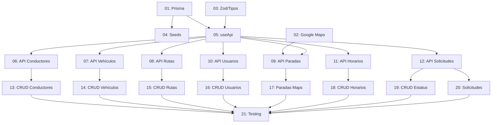

# Casos de Desarrollo - Sistema CESAC

**Proyecto:** Sistema de Ubicación Vehicular CESAC
**Fecha inicio:** 2025-02-10
**Tecnologías:** Next.js 15, Prisma, PostgreSQL, Google Maps API, React Hook Form, Zod

---

## Índice de Historias de Usuario

### 🏗️ Fase 1: Infraestructura (Historias 01-04)

| # | Historia | Estado | Estimación | Prioridad |
|---|----------|--------|------------|-----------|
| 01 | [Setup Prisma con PostgreSQL](./HISTORIA-01-setup-prisma-postgresql.md) | ⏳ Pendiente | 2-3h | CRÍTICA |
| 02 | [Setup Google Maps API](./HISTORIA-02-setup-google-maps.md) | ⏳ Pendiente | 3-4h | ALTA |
| 03 | [Schemas Zod y Tipos TypeScript](./HISTORIA-03-schemas-zod-tipos.md) | ⏳ Pendiente | 2-3h | ALTA |
| 04 | [Seed de Datos Iniciales](./HISTORIA-04-seed-datos-iniciales.md) | ⏳ Pendiente | 1-2h | MEDIA |

### 🔌 Fase 2: API Routes (Historias 05-12)

| # | Historia | Estado | Estimación | Prioridad |
|---|----------|--------|------------|-----------|
| 05 | [Hook useApi y API Base](./HISTORIA-05-hook-useapi.md) | ⏳ Pendiente | 1-2h | ALTA |
| 06 | [API Routes: Conductores](./HISTORIA-06-api-conductores.md) | ⏳ Pendiente | 2-3h | ALTA |
| 07 | [API Routes: Vehículos](./HISTORIA-07-api-vehiculos.md) | ⏳ Pendiente | 2-3h | ALTA |
| 08 | [API Routes: Rutas](./HISTORIA-08-api-rutas.md) | ⏳ Pendiente | 2-3h | ALTA |
| 09 | [API Routes: Paradas](./HISTORIA-09-api-paradas.md) | ⏳ Pendiente | 2-3h | ALTA |
| 10 | [API Routes: Usuarios](./HISTORIA-10-api-usuarios.md) | ⏳ Pendiente | 2-3h | ALTA |
| 11 | [API Routes: Horarios](./HISTORIA-11-api-horarios.md) | ⏳ Pendiente | 2-3h | MEDIA |
| 12 | [API Routes: Solicitudes y Estatus](./HISTORIA-12-api-solicitudes-estatus.md) | ⏳ Pendiente | 2-3h | MEDIA |

### 🎨 Fase 3: Componentes CRUD (Historias 13-20)

| # | Historia | Estado | Estimación | Prioridad |
|---|----------|--------|------------|-----------|
| 13 | [CRUD Frontend: Conductores](./HISTORIA-13-crud-conductores.md) | ⏳ Pendiente | 3-4h | ALTA |
| 14 | [CRUD Frontend: Vehículos](./HISTORIA-14-crud-vehiculos.md) | ⏳ Pendiente | 3-4h | ALTA |
| 15 | [CRUD Frontend: Rutas](./HISTORIA-15-crud-rutas.md) | ⏳ Pendiente | 3-4h | ALTA |
| 16 | [CRUD Frontend: Usuarios](./HISTORIA-16-crud-usuarios.md) | ⏳ Pendiente | 3-4h | ALTA |
| 17 | [Página de Paradas con Google Maps](./HISTORIA-17-paradas-con-maps.md) | ⏳ Pendiente | 4-5h | ALTA |
| 18 | [CRUD Frontend: Horarios](./HISTORIA-18-crud-horarios.md) | ⏳ Pendiente | 3-4h | MEDIA |
| 19 | [CRUD Frontend: Estatus Vehículos](./HISTORIA-19-crud-estatus.md) | ⏳ Pendiente | 2-3h | BAJA |
| 20 | [Actualizar Vista Solicitudes con BD](./HISTORIA-20-actualizar-solicitudes.md) | ⏳ Pendiente | 2-3h | MEDIA |

### ✅ Fase 4: Testing y Verificación (Historia 21)

| # | Historia | Estado | Estimación | Prioridad |
|---|----------|--------|------------|-----------|
| 21 | [Testing End-to-End y Verificación](./HISTORIA-21-testing-verificacion.md) | ⏳ Pendiente | 4-6h | CRÍTICA |

---

## Orden Sugerido de Implementación

### Día 1: Infraestructura
```
Morning:   Historia 01 (Prisma)
           Historia 02 (Google Maps)
Afternoon: Historia 03 (Zod/Tipos)
           Historia 04 (Seeds)
```

### Día 2: API Routes - Parte 1
```
Morning:   Historia 05 (useApi hook)
           Historia 06 (API Conductores)
           Historia 07 (API Vehículos)
Afternoon: Historia 08 (API Rutas)
           Historia 09 (API Paradas)
```

### Día 3: API Routes - Parte 2 + CRUD Frontend
```
Morning:   Historia 10 (API Usuarios)
           Historia 11 (API Horarios)
           Historia 12 (API Solicitudes/Estatus)
Afternoon: Historia 13 (CRUD Conductores)
           Historia 14 (CRUD Vehículos)
```

### Día 4: CRUD Frontend
```
Morning:   Historia 15 (CRUD Rutas)
           Historia 16 (CRUD Usuarios)
Afternoon: Historia 17 (Paradas con Maps) ⭐ IMPORTANTE
           Historia 18 (CRUD Horarios)
```

### Día 5: Finalización
```
Morning:   Historia 19 (CRUD Estatus)
           Historia 20 (Actualizar Solicitudes)
Afternoon: Historia 21 (Testing E2E) ✅
```

---

## Dependencias Entre Historias



---

## Checklist de Progreso General

### Infraestructura
- [ ] Prisma instalado y configurado
- [ ] Base de datos con 9 tablas creadas
- [ ] Google Maps API funcionando
- [ ] MapPicker component implementado
- [ ] Schemas Zod para validación
- [ ] Tipos TypeScript con Prisma
- [ ] Datos iniciales en BD (seed)

### Backend (API Routes)
- [ ] Hook useApi implementado
- [ ] API Conductores (5 endpoints)
- [ ] API Vehículos (5 endpoints)
- [ ] API Rutas (6 endpoints)
- [ ] API Paradas (5 endpoints)
- [ ] API Usuarios (5 endpoints)
- [ ] API Horarios (5 endpoints)
- [ ] API Solicitudes (5 endpoints)
- [ ] API Estatus Vehículos (5 endpoints)

### Frontend (CRUD)
- [ ] CRUD Conductores completo
- [ ] CRUD Vehículos completo
- [ ] CRUD Rutas completo
- [ ] CRUD Usuarios completo
- [ ] Paradas con selector de mapa
- [ ] CRUD Horarios completo
- [ ] CRUD Estatus completo
- [ ] Vista Solicitudes con BD

### Testing
- [ ] Tests unitarios de APIs
- [ ] Tests de integración
- [ ] Flujo E2E completo
- [ ] Performance verificada
- [ ] Prisma Studio validado

---

## Métricas del Proyecto

**Total de Archivos a Crear:** ~45 archivos
**Total de Archivos a Modificar:** ~10 archivos
**Líneas de Código Estimadas:** 8,000-10,000 líneas
**Duración Estimada:** 4-5 días de desarrollo intensivo

---

## Convenciones de Código

### Nombres de Archivos
- API Routes: `route.ts` (en carpetas por recurso)
- Componentes: `kebab-case.tsx`
- Hooks: `use-nombre.ts`
- Utils: `nombre.ts`

### Estructura de Componentes CRUD
```
1. Imports
2. Types/Interfaces
3. Component Definition
4. State Management
5. useEffects
6. Handlers
7. Helper Functions
8. Return JSX
```

### Commits
```
feat(modulo): descripción corta
fix(modulo): corrección de bug
docs(modulo): documentación
refactor(modulo): refactorización
```

---

## Recursos

### Documentación
- [Documentación Prisma](https://www.prisma.io/docs)
- [Google Maps JavaScript API](https://developers.google.com/maps/documentation/javascript)
- [React Hook Form](https://react-hook-form.com/)
- [Zod Validation](https://zod.dev/)

### Herramientas
- Prisma Studio: `npm run prisma:studio`
- Next.js Dev: `npm run dev`
- Genkit Dev: `npm run genkit:dev`

---

## Contacto y Soporte

**Desarrollador:** Claude AI Assistant
**Fecha:** 2025-02-10
**Versión del Plan:** 1.0

---

## Notas Importantes

⚠️ **Antes de Empezar:**
1. Hacer backup de la base de datos `suv_db`
2. Verificar que el puerto 9002 está libre
3. Asegurar que Google Maps Billing está habilitado
4. NO commitear el archivo `.env` con API keys reales

🔒 **Seguridad:**
- API Keys deben tener restricciones de dominio
- Usar variables de entorno para secrets
- Validar todos los inputs con Zod
- Sanitizar datos antes de guardar en BD

📝 **Documentación:**
- Cada historia tiene su propio archivo detallado
- Seguir el orden de dependencias
- Marcar historias como completadas en este README
- Actualizar el estado después de cada historia

---

**Última actualización:** 2025-02-10
