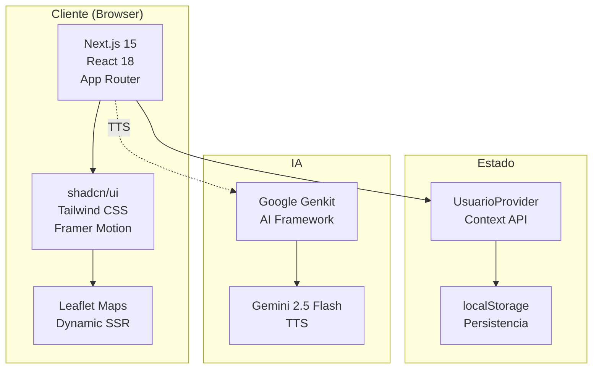

# Sistema de Ubicación Vehicular CESAC

**Versión 1.0** | **Última actualización:** Febrero 2025
**Autor:** Dirección de Tecnología y Comunicaciones del CESAC

---

## Descripción

CESAC es un sistema integral de gestión y monitoreo de transporte empresarial que permite el seguimiento en tiempo real de vehículos, la gestión administrativa de rutas, conductores y pasajeros, así como la notificación inteligente de paradas con sistema de penalizaciones.

Construido con Next.js 15 y React 18, el sistema ofrece tres interfaces especializadas:
- **Dashboard Administrativo:** Panel de control completo con monitoreo GPS, gestión de usuarios, rutas, vehículos y reportes
- **Vista Móvil de Usuario:** Aplicación para pasajeros con notificaciones de parada, tracking y encuestas
- **Vista del Conductor:** Panel en tiempo real para operadores de buses con TTS integrado

---

## Características Principales

### 🗺️ Monitoreo en Tiempo Real
- Mapa interactivo con ubicación de todos los buses
- Actualización de estado en tiempo real (En ruta, Retrasado, Detenido)
- Visualización de velocidad y próxima parada
- Filtrado por rutas (Charles de Gaulle, Autopista Duarte, Independencia)

### 🔔 Sistema de Notificaciones Inteligente
- Notificación de parada con countdown en tiempo real
- Alerta de proximidad (20 segundos antes de llegada)
- Sistema de penalización por cancelaciones (10 minutos)
- Encuestas de satisfacción post-viaje

### 🚌 Gestión de Flota
- Administración de vehículos con estado mecánico
- Registro de mantenimiento y documentación
- Asignación de conductores y turnos
- Rutas especiales para eventos

### 👥 Gestión de Usuarios
- Registro y asignación de empleados a rutas
- Historial completo de viajes
- Exportación de datos a Excel/PDF
- Sistema de roles (admin/usuario)

### 📊 Reportes y Analíticas
- Reportes diarios de movilidad
- Gráficos de puntualidad por ruta
- Tiempos promedio de recorrido
- Frecuencia de uso por ruta

### 🎤 Text-to-Speech (TTS)
- Anuncios automáticos de paradas
- Integración con Google Genkit AI
- Voz femenina (Achernar) en español
- Generación en tiempo real

### 🌓 Modo Oscuro
- Soporte completo para temas claro/oscuro
- Transiciones suaves
- Persistencia de preferencias

---

## Índice de Documentación

Esta documentación está organizada en los siguientes documentos:

| Documento | Descripción |
|-----------|-------------|
| **[arquitectura.md](./arquitectura.md)** | Arquitectura técnica del sistema, stack tecnológico, estructura de carpetas y patrones de diseño |
| **[entidades.md](./entidades.md)** | Documentación completa de todas las entidades, DTOs, interfaces y relaciones |
| **[pantallas-y-navegacion.md](./pantallas-y-navegacion.md)** | Mapa de todas las pantallas, rutas, layouts y flujos de navegación |
| **[flujos-de-proceso.md](./flujos-de-proceso.md)** | Flujos complejos del sistema con diagramas (notificaciones, TTS, tracking) |
| **[componentes.md](./componentes.md)** | Catálogo de componentes reutilizables de UI y componentes personalizados |
| **[guia-desarrollo.md](./guia-desarrollo.md)** | Guía práctica para desarrolladores con convenciones, troubleshooting y recursos |
| **[blueprint.md](./blueprint.md)** | Diseño inicial y especificaciones del proyecto |

---

## Inicio Rápido

### Requisitos Previos

Antes de comenzar, asegúrate de tener instalado:

- **Node.js 20+** (recomendado: 20.11.0 o superior)
- **npm** o **pnpm**
- **Genkit CLI:** `npm install -g genkit-cli` (opcional, para desarrollo de IA)
- **Git**

### Variables de Entorno

Crea un archivo `.env` en la raíz del proyecto con las siguientes variables:

```bash
# Google AI API Key (para Text-to-Speech)
GOOGLE_API_KEY=tu_api_key_aqui
```

### Instalación

```bash
# 1. Clonar el repositorio
git clone [url-del-repositorio]
cd cesac

# 2. Instalar dependencias
npm install

# 3. Iniciar servidor de desarrollo
npm run dev
```

El servidor se iniciará en **http://localhost:9002**

---

## Scripts Disponibles

```bash
# Desarrollo
npm run dev              # Servidor de desarrollo con Turbopack (puerto 9002)
npm run genkit:dev       # UI de desarrollo de Google Genkit (puerto 4000)
npm run genkit:watch     # Genkit con hot-reload automático

# Compilación
npm run build            # Compilar para producción
npm start                # Iniciar servidor de producción

# Calidad de código
npm run typecheck        # Verificar tipos TypeScript
npm run lint             # Ejecutar ESLint

# Deployment
npm run build     # Build para producción
npm start         # Servidor de producción local
```

---

## Estructura del Proyecto

```
cesac/
├── src/
│   ├── app/                    # Next.js App Router (26 páginas)
│   │   ├── api/tts/           # API Route para Text-to-Speech
│   │   ├── dashboard/         # Panel administrativo (15 páginas)
│   │   ├── usuario/           # Vista móvil de usuario (5 páginas)
│   │   ├── vista-bus/         # Vista del conductor
│   │   ├── layout.tsx         # Layout raíz
│   │   └── page.tsx           # Página de login
│   ├── components/
│   │   ├── ui/                # 35+ componentes shadcn/ui
│   │   └── [...15+ componentes personalizados]
│   ├── lib/
│   │   ├── audio.ts           # Sistema de sonidos
│   │   ├── data.ts            # Datos iniciales
│   │   └── utils.ts           # Utilidades
│   └── hooks/                 # Custom React hooks
├── ai/
│   ├── genkit.ts              # Configuración de Google Genkit
│   └── flows/                 # Flujos de IA (TTS)
├── docs/                      # Esta documentación
└── public/                    # Recursos estáticos
```

Para más detalles sobre la estructura, ver [arquitectura.md](./arquitectura.md).

---

## Tecnologías Utilizadas

| Categoría | Tecnología | Versión | Propósito |
|-----------|-----------|---------|-----------|
| **Framework** | Next.js | 15.3.3 | Framework React con SSR y App Router |
| | React | 18.3.1 | Biblioteca UI |
| **UI/Estilos** | Tailwind CSS | 3.4.1 | Framework CSS utility-first |
| | shadcn/ui | - | 35+ componentes UI accesibles |
| | Framer Motion | 11.3.19 | Animaciones y transiciones |
| | lucide-react | 0.475.0 | Iconos |
| **Formularios** | React Hook Form | 7.54.2 | Gestión de formularios |
| | Zod | 3.24.2 | Validación de esquemas |
| **IA/TTS** | Google Genkit | 1.13.0 | Framework de IA |
| | Gemini 2.5 Flash TTS | - | Text-to-Speech |
| **Mapas** | Leaflet | 1.9.4 | Mapas interactivos |
| **Gráficos** | Recharts | 2.15.1 | Gráficos y visualizaciones |
| **Temas** | next-themes | 0.3.0 | Modo oscuro/claro |
| **Audio** | wav | 1.0.2 | Conversión de audio |
| **Otros** | TypeScript | 5.x | Tipado estático |
| | date-fns | 3.6.0 | Manipulación de fechas |
| | qrcode.react | 3.1.0 | Generación de códigos QR |

---

## Primeros Pasos

### 1. Familiarízate con la Arquitectura
Lee [arquitectura.md](./arquitectura.md) para entender el stack tecnológico, estructura de carpetas y patrones de diseño utilizados.

### 2. Comprende las Entidades
Revisa [entidades.md](./entidades.md) para conocer todas las entidades del sistema (Bus, Driver, Vehicle, Route, User, etc.) y sus relaciones.

### 3. Explora las Pantallas
Consulta [pantallas-y-navegacion.md](./pantallas-y-navegacion.md) para ver el mapa completo de las 26 páginas del sistema y cómo navegar entre ellas.

### 4. Estudia los Flujos Críticos
Lee [flujos-de-proceso.md](./flujos-de-proceso.md) para entender los flujos complejos como:
- Notificación de parada con countdown
- Sistema de penalización
- Text-to-Speech con Google Genkit
- Tracking de proximidad

### 5. Consulta el Catálogo de Componentes
Revisa [componentes.md](./componentes.md) para conocer los 35+ componentes UI de shadcn/ui y los 15+ componentes personalizados disponibles.

### 6. Configura tu Entorno de Desarrollo
Sigue [guia-desarrollo.md](./guia-desarrollo.md) para configurar tu entorno, aprender las convenciones de código y resolver problemas comunes.

---

## Arquitectura Visual



---

## Módulos Principales

### Dashboard Administrativo (`/dashboard`)
- **Panel de Control GPS:** Mapa en tiempo real con 12 buses activos
- **Solicitudes y Paradas:** Gestión de solicitudes por ruta con estados
- **Gestión de Rutas:** CRUD completo de rutas y paradas
- **Gestión de Usuarios:** Registro, asignación y exportación
- **Choferes y Vehículos:** Administración de flota y conductores
- **Reportes:** Gráficos de puntualidad, tiempos y frecuencia
- **Data Master:** Hub central con 5 módulos de configuración

### Vista Móvil de Usuario (`/usuario`)
- **Inicio:** Notificación de parada con countdown y alertas
- **Horarios:** Consulta de horarios con tracking de proximidad
- **Historial:** Lista completa de viajes realizados
- **Perfil:** Gestión de información personal

### Vista del Conductor (`/vista-bus`)
- **Panel de Control:** Reloj digital, estado de conexión
- **Gestión de Ruta:** Iniciar/finalizar ruta con timer
- **Confirmación de Paradas:** Con TTS automático
- **Control de Estado:** En ruta, retrasado, dañado, 911

---

## Rutas Operativas

El sistema gestiona 4 rutas principales:

1. **Ruta Charles de Gaulle** - 15 paradas
2. **Ruta Autopista Duarte** - 12 paradas
3. **Ruta Independencia** - 18 paradas
4. **Ruta 27 de Febrero** - 22 paradas (inactiva)

Además, soporta **rutas especiales** para eventos corporativos y mantenimientos.

---

## Contribución y Soporte

Este proyecto es desarrollado y mantenido por la **Dirección de Tecnología y Comunicaciones del CESAC**.

**Desarrollado por:** Kendy Qualey
**Año:** 2025
**Versión:** 1.0

Para reportar problemas o sugerencias, contacta al equipo de desarrollo.

---

## Recursos Adicionales

### Documentación Externa
- [Next.js 15 Documentation](https://nextjs.org/docs)
- [React 18 Documentation](https://react.dev)
- [Tailwind CSS Documentation](https://tailwindcss.com/docs)
- [shadcn/ui Components](https://ui.shadcn.com)
- [Google Genkit Documentation](https://firebase.google.com/docs/genkit)
- [Leaflet Documentation](https://leafletjs.com)

### Herramientas de Desarrollo
- [React DevTools](https://chrome.google.com/webstore/detail/react-developer-tools/fmkadmapgofadopljbjfkapdkoienihi)
- [Genkit Developer UI](http://localhost:4000) (durante desarrollo)

---

## Licencia

© 2025 CESAC - Centro de Servicios Administrativos y Comerciales
Dirección de Tecnología y Comunicaciones

Todos los derechos reservados.
