# 🛡️ Pruebas E2E — Acceso de Administrador

**Rol:** Administrador  
**Área protegida:** `/dashboard`  
**Credenciales de prueba:** `admin@cesac.com` / `admin123`

---

## ▶️ Video del recorrido

[`recorrido-admin.webm`](./recorrido-admin.webm) — recorrido completo de las pantallas de este rol (formato WebM).

> GitHub/VS Code reproducen `.webm` en línea; si tu visor no lo soporta, descárgalo.

---

## ✅ Validaciones de control de acceso

- El admin **inicia sesión** y entra a `/dashboard`.
- Los endpoints de gestión (`/api/dashboard/stats`, `/api/usuarios`) responden **200 OK** con su sesión.
- Sin sesión, esos endpoints responden **401/403**.

---

## 🖼️ Pantallas (16)

### Login

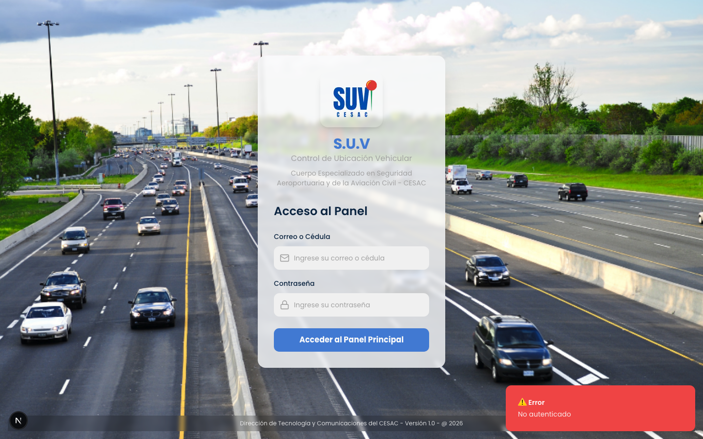

### Panel control gps

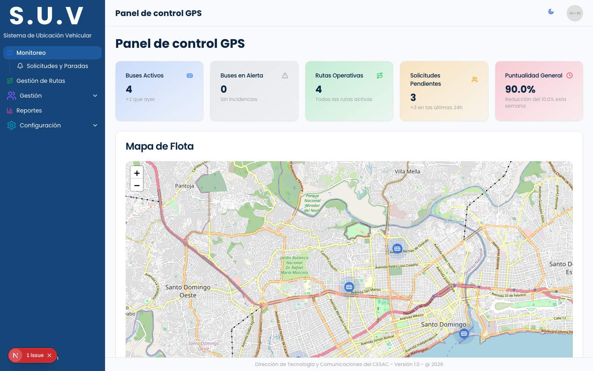

### Solicitudes y paradas

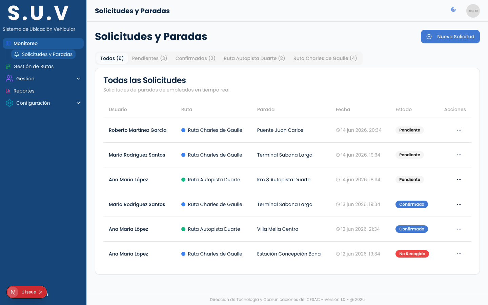

### Gestion rutas

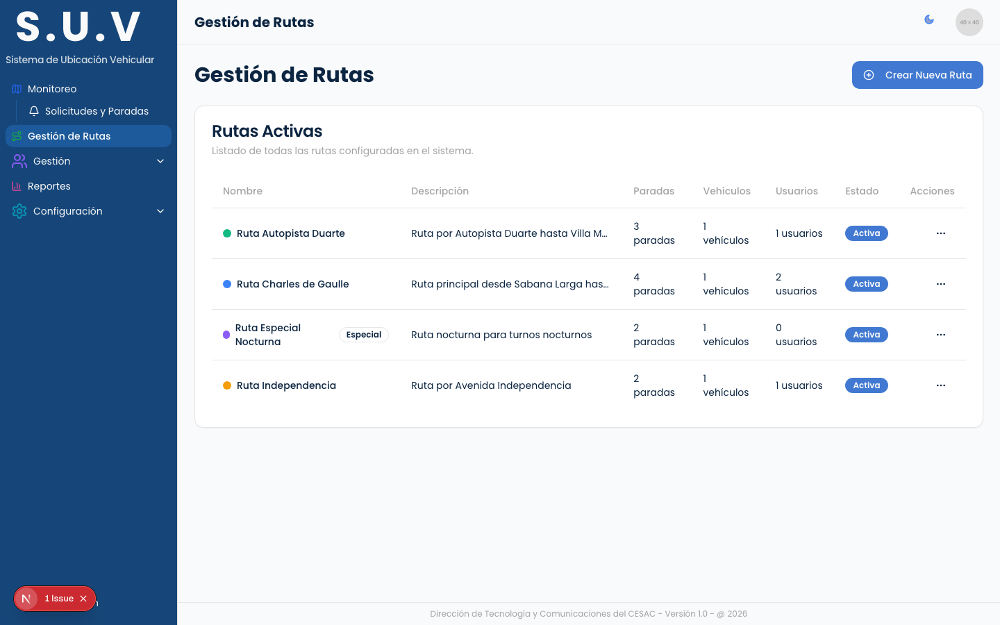

### Gestion usuarios

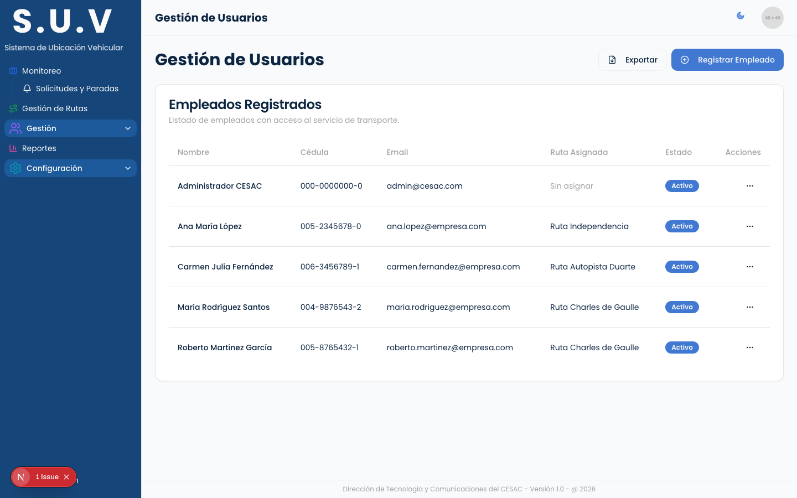

### Choferes y vehiculos

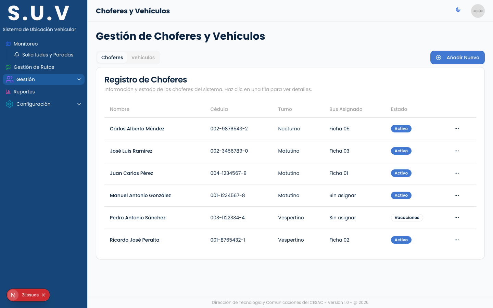

### Horarios

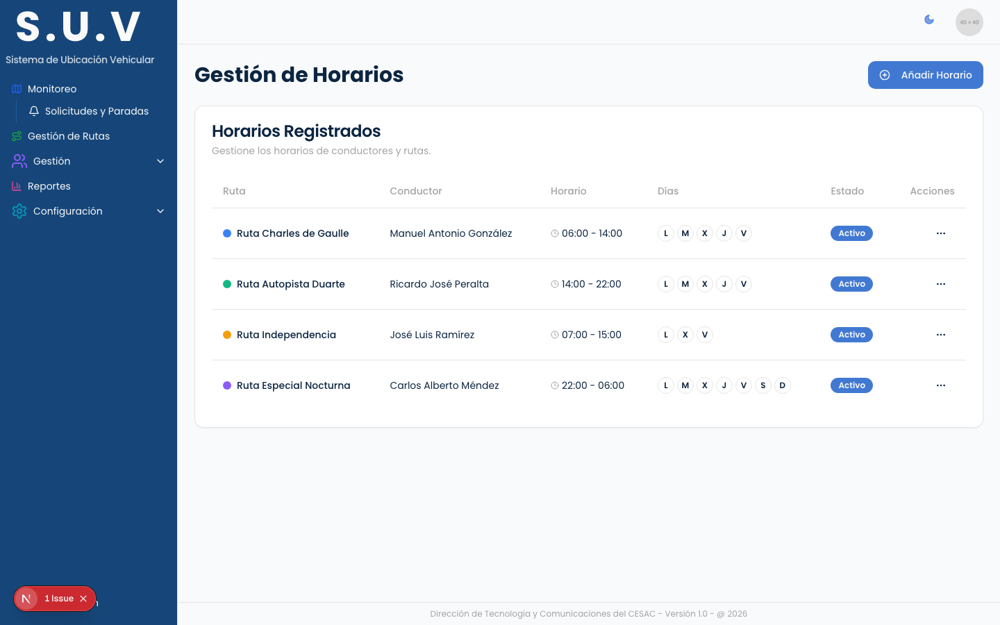

### Reportes

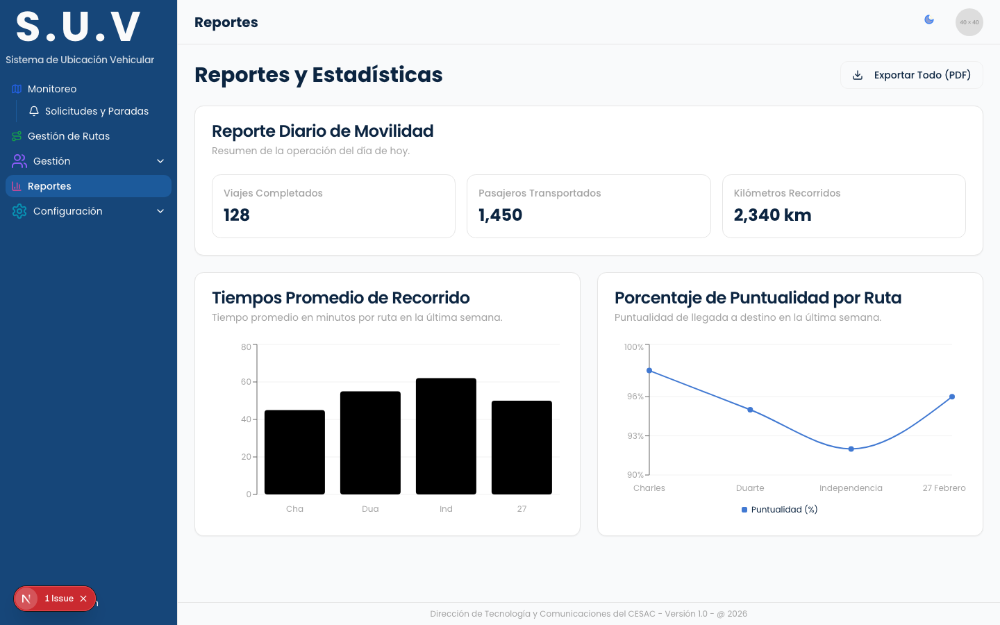

### Configuracion

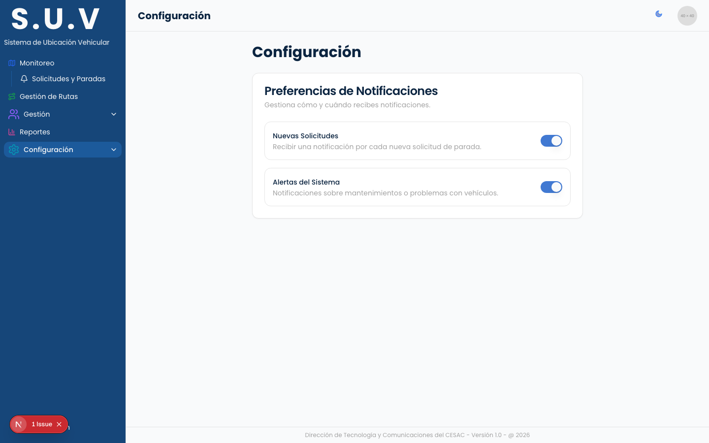

### Data master

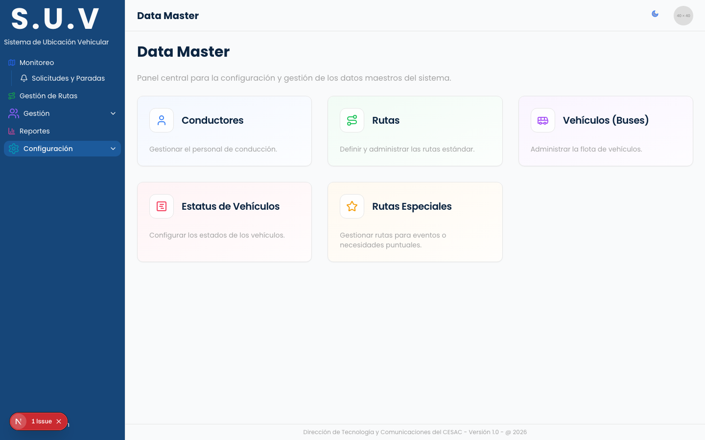

### Data master conductores

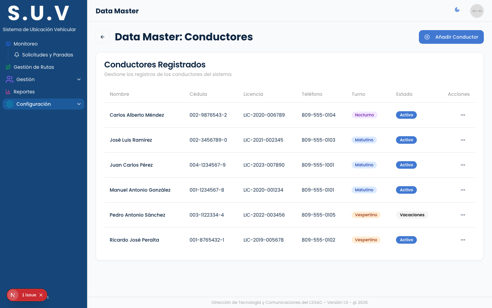

### Data master vehiculos

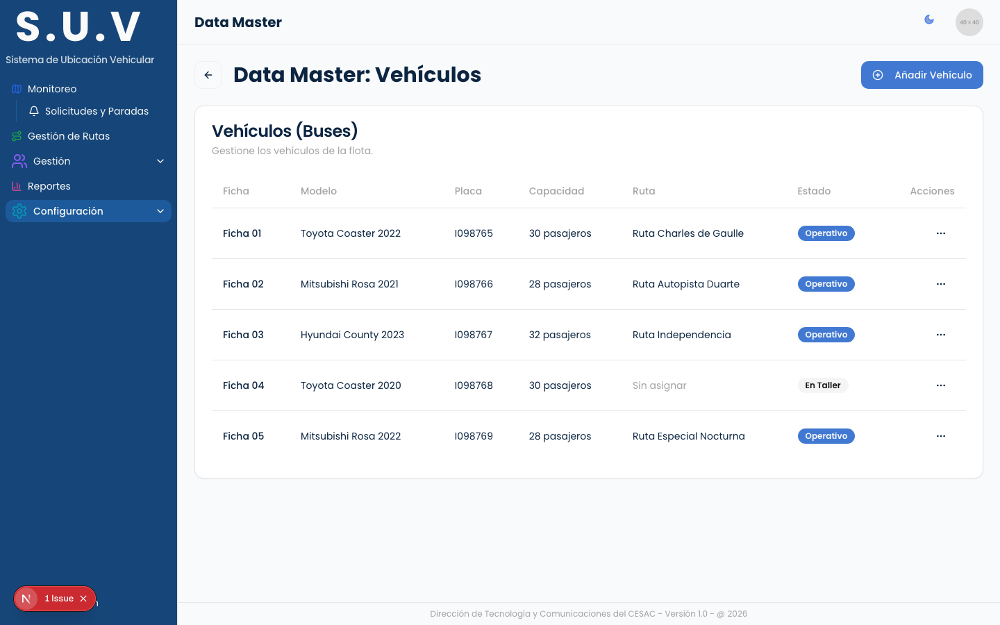

### Data master rutas

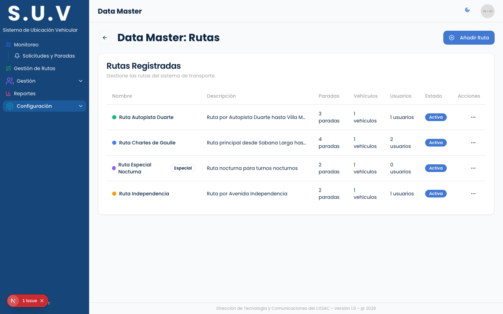

### Data master rutas especiales

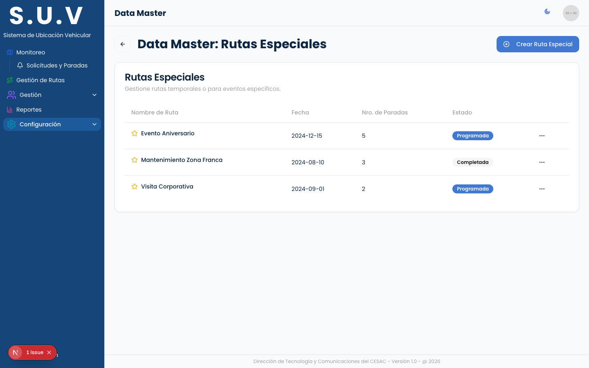

### Data master estatus vehiculo

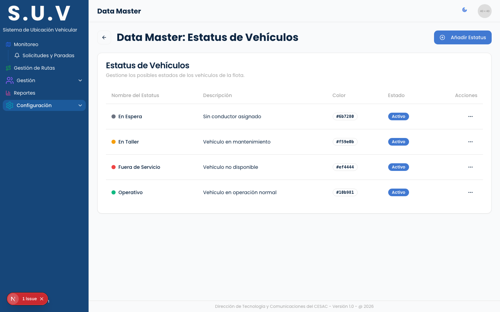

### Perfil

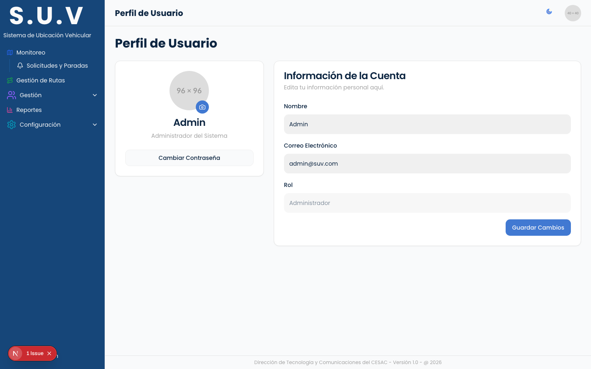

