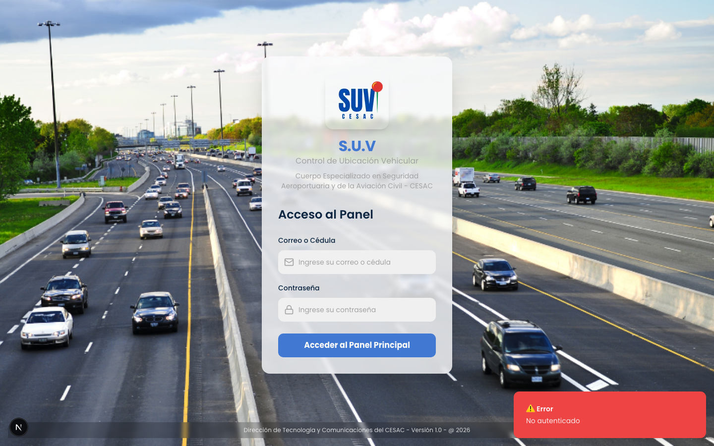
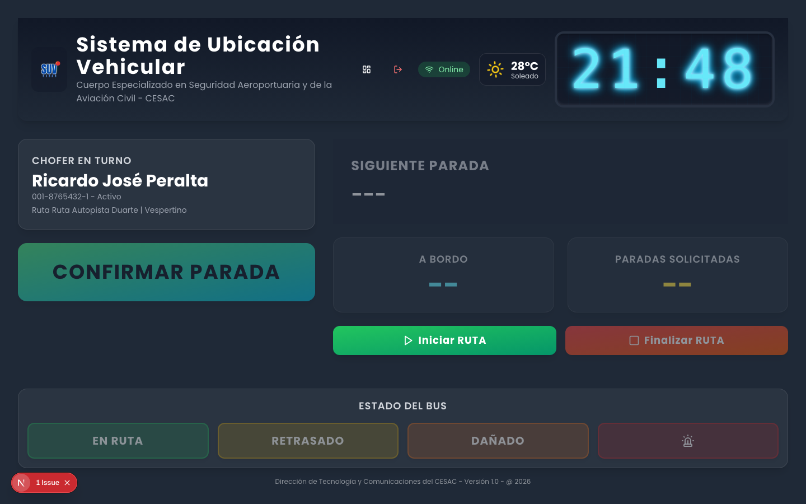

# 🚍 Pruebas E2E — Acceso de Choferes

**Rol:** Chofer (conductor)  
**Área protegida:** `/vista-bus`  
**Credenciales de prueba:** cédula `001-8765432-1` / contraseña = la misma cédula (Ricardo José Peralta, con vehículo y ruta asignados)

---

## ▶️ Video del recorrido

[`recorrido-chofer.webm`](./recorrido-chofer.webm) — recorrido completo de las pantallas de este rol (formato WebM).

> GitHub/VS Code reproducen `.webm` en línea; si tu visor no lo soporta, descárgalo.

---

## ✅ Validaciones de control de acceso

- El chofer **inicia sesión con su cédula** como contraseña y entra a `/vista-bus`.
- Una **cédula correcta con contraseña errónea es rechazada** (401).
- El chofer **NO puede entrar a `/dashboard`** (lo redirige).
- El endpoint `/api/conductores/me` devuelve sus datos.

---

## 🖼️ Pantallas (2)

### Login

### Vista bus

