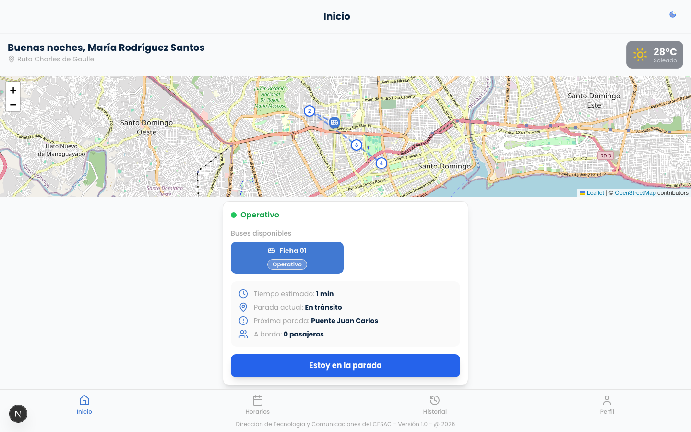
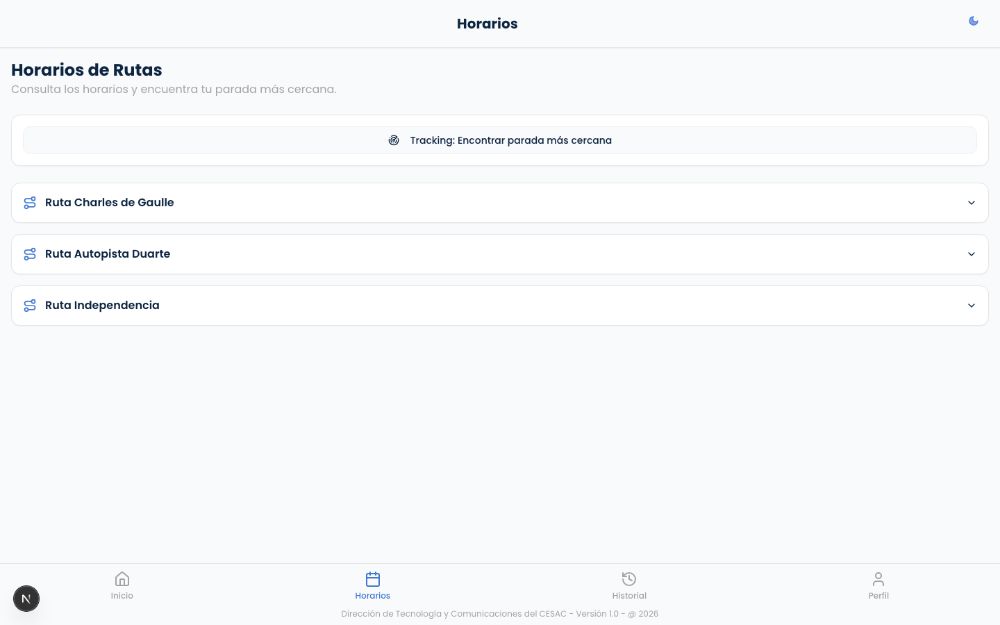
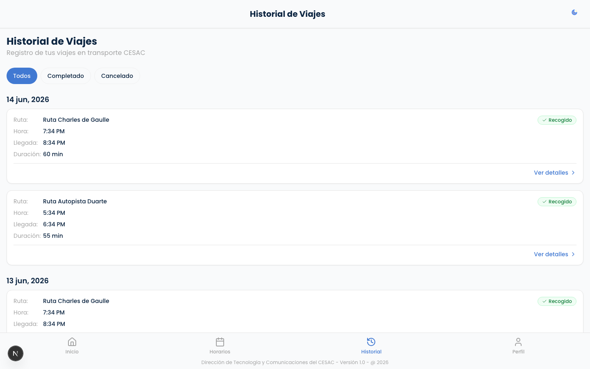
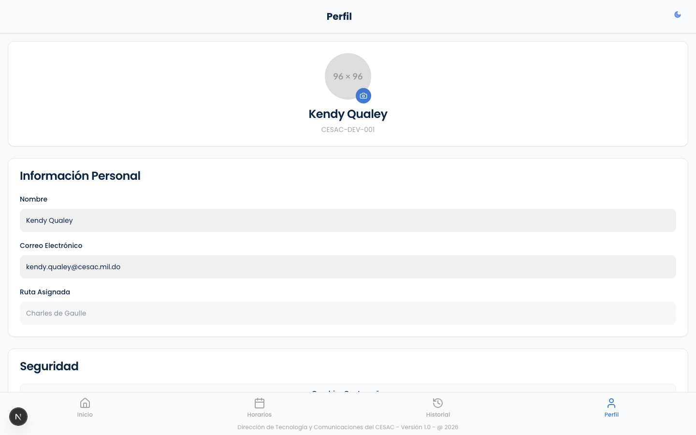

# 👤 Pruebas E2E — Acceso de Usuarios (consultar su ruta)

**Rol:** Usuario final (pasajero)  
**Área protegida:** `/usuario`  
**Credenciales de prueba:** `maria.rodriguez@empresa.com` / `password123` (ruta Charles de Gaulle)

---

## ▶️ Video del recorrido

[`recorrido-usuario.webm`](./recorrido-usuario.webm) — recorrido completo de las pantallas de este rol (formato WebM).

> GitHub/VS Code reproducen `.webm` en línea; si tu visor no lo soporta, descárgalo.

---

## ✅ Validaciones de control de acceso

- El usuario **solo ve las paradas de su ruta** (`/api/usuarios/me/paradas`).
- El usuario **NO puede entrar a `/dashboard`** ni a `/vista-bus` (lo redirige).
- El usuario **NO puede usar endpoints de admin** (responden 403).

---

## 🖼️ Pantallas (5)

### Login

### Inicio mapa ruta

### Horarios

### Historial

### Perfil

