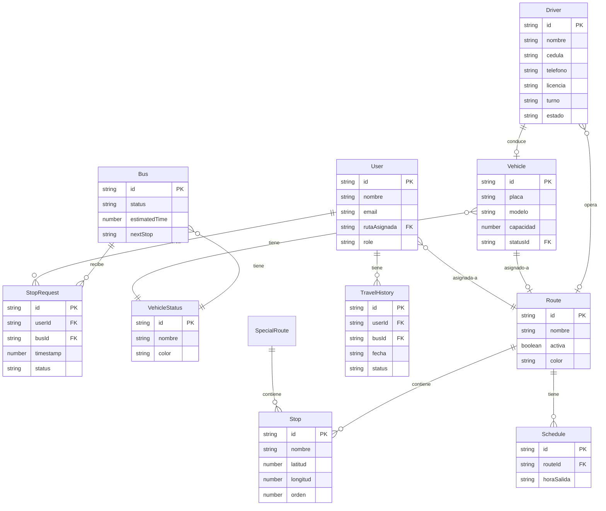

# Entidades y Modelos de Datos - CESAC

**Última actualización:** Febrero 2025

---

## Tabla de Contenidos

- [Introducción](#introducción)
- [Tabla Resumen de Entidades](#tabla-resumen-de-entidades)
- [Entidades Principales](#entidades-principales)
- [Constantes del Sistema](#constantes-del-sistema)
- [Diagrama de Relaciones](#diagrama-de-relaciones)
- [Estados y Enumeraciones](#estados-y-enumeraciones)

---

## Introducción

Este documento describe todas las entidades, DTOs (Data Transfer Objects), interfaces TypeScript y estructuras de datos utilizadas en el sistema CESAC. El proyecto no utiliza un ORM tradicional ni esquemas de validación formales en el backend, sino que define interfaces TypeScript para garantizar la seguridad de tipos en el cliente.

**Convenciones:**
- Todas las interfaces están escritas en TypeScript
- Los IDs son strings (formato: "ENTITY-XXX" o "EntityNNN")
- Las fechas se manejan como strings (ISO 8601)
- Los estados son strings con valores predefinidos

---

## Tabla Resumen de Entidades

| Entidad | Descripción | Ubicación en Código | Relaciones Principales |
|---------|-------------|---------------------|------------------------|
| **Bus** | Bus en tiempo real para tracking | [usuario-provider.tsx](../src/app/usuario/usuario-provider.tsx:11-16) | VehicleStatus, Route |
| **Driver** | Conductor de vehículos | data-master/conductores | Vehicle, Route |
| **Vehicle** | Vehículo de la flota | data-master/vehiculos | Driver, VehicleStatus |
| **Route** | Ruta estándar | data-master/rutas | Vehicle, User, Stop |
| **SpecialRoute** | Ruta especial/eventos | data-master/rutas-especiales | Route, Stop |
| **User** | Usuario del sistema | dashboard/usuarios | Route, TravelHistory |
| **TravelHistory** | Historial de viajes | usuario/historial | User, Bus |
| **StopRequest** | Solicitud de parada | dashboard/solicitudes | User, Bus |
| **VehicleStatus** | Estado de vehículo | data-master/estatus-vehiculo | Vehicle |
| **Schedule** | Horario de ruta | usuario/horarios | Route |
| **AnalysisResult** | Análisis de proximidad | usuario/horarios | Route |
| **UsuarioContextType** | Context global usuario | usuario-provider.tsx | Bus, User |

---

## Entidades Principales

### Bus

**Ubicación:** [src/app/usuario/usuario-provider.tsx:11-16](../src/app/usuario/usuario-provider.tsx:11-16)

**Propósito:** Representa un bus en tiempo real para el sistema de tracking de usuarios.

```typescript
export interface Bus {
  id: string;              // Identificador único (ej: "BUSCESAC-1", "BUSCESAC-2")
  status: string;          // Estado actual del bus
  estimatedTime: number;   // Tiempo estimado de llegada en minutos
  nextStop: string;        // Nombre de la próxima parada
}
```

**Campos:**
- `id`: Identificador único del bus. Formato: "BUSCESAC-N"
- `status`: Estado actual. Valores: "En ruta", "Retrasado", "Detenido", "Fuera de Servicio", "Dañado", "911"
- `estimatedTime`: Tiempo estimado de llegada en minutos (número entero positivo)
- `nextStop`: Nombre legible de la próxima parada (ej: "Cruce Sabana Larga", "Puente Juan Carlos")

**Uso en el sistema:**
- Tracking en tiempo real de buses
- Actualización de estado desde Vista del Bus
- Selección de bus en Vista de Usuario
- Cálculo de countdown para notificaciones

**Datos iniciales:**
```typescript
// src/lib/data.ts
export const initialBusesData: Bus[] = [
  {
    id: "BUSCESAC-1",
    status: "En ruta",
    estimatedTime: 1,
    nextStop: "Cruce Sabana Larga"
  },
  {
    id: "BUSCESAC-2",
    status: "Retrasado",
    estimatedTime: 12,
    nextStop: "Puente Juan Carlos"
  },
];
```

**Estados posibles del bus:**
- 🟢 **En ruta**: Bus circulando normalmente
- 🟡 **Retrasado**: Bus con retraso en el horario
- ⏸️ **Detenido**: Bus temporalmente detenido
- 🔴 **Dañado**: Bus con problemas mecánicos
- 🆘 **911**: Emergencia
- ⚫ **Fuera de Servicio**: Bus no operativo

---

### Driver (Conductor)

**Ubicación:** Módulo `data-master/conductores`

**Propósito:** Información completa de conductores de la flota.

```typescript
interface Driver {
  id: string;                   // ID único del conductor
  nombre: string;               // Nombre completo
  cedula: string;               // Cédula de identidad
  telefono: string;             // Teléfono de contacto
  email?: string;               // Email (opcional)
  licencia: string;             // Número de licencia de conducir
  foto?: string;                // URL de la foto (opcional)
  turno: 'Matutino' | 'Vespertino' | 'Nocturno';  // Turno de trabajo
  vehiculoAsignado?: string;    // ID del vehículo asignado (opcional)
  rutaActual?: string;          // ID de la ruta actual (opcional)
  estado: 'Activo' | 'Vacaciones' | 'Inactivo';   // Estado laboral
  fechaIngreso: string;         // Fecha de ingreso (ISO 8601)
}
```

**Campos:**
- `id`: Identificador único. Formato sugerido: "CESAC-CH-XXX"
- `nombre`: Nombre completo del conductor
- `cedula`: Documento de identidad
- `telefono`: Número de contacto
- `email`: Correo electrónico (opcional)
- `licencia`: Número de licencia de conducir
- `foto`: URL a la foto del conductor (puede ser externa o en `/public`)
- `turno`: Turno de trabajo asignado
- `vehiculoAsignado`: Referencia al ID del vehículo que conduce
- `rutaActual`: Referencia al ID de la ruta que opera actualmente
- `estado`: Estado laboral del conductor
- `fechaIngreso`: Fecha de inicio en la empresa

**Relaciones:**
- **1:1 con Vehicle**: Un conductor puede estar asignado a un vehículo
- **M:N con Route**: Un conductor puede operar múltiples rutas en diferentes horarios

**Ejemplo de datos:**
```typescript
{
  id: "CESAC-CH-001",
  nombre: "Manuel Gonzalez",
  cedula: "001-1234567-8",
  telefono: "809-555-0101",
  email: "mgonzalez@cesac.do",
  licencia: "LIC-2022-001",
  foto: "https://i.postimg.cc/avatar1.jpg",
  turno: "Matutino",
  vehiculoAsignado: "Ficha 01",
  rutaActual: "RUTA-01",
  estado: "Activo",
  fechaIngreso: "2022-01-15"
}
```

---

### Vehicle (Vehículo)

**Ubicación:** Módulo `data-master/vehiculos`

**Propósito:** Información de vehículos de la flota.

```typescript
interface Vehicle {
  id: string;                   // Ficha del vehículo
  placa: string;                // Placa vehicular
  modelo: string;               // Modelo del vehículo
  anio: number;                 // Año de fabricación
  capacidad: number;            // Capacidad de pasajeros
  statusId: string;             // Referencia a VehicleStatus
  proximoMantenimiento?: string; // Fecha próximo mantenimiento (ISO 8601)
  documentacion?: {             // Documentación del vehículo (opcional)
    seguro: string;             // Fecha vencimiento seguro
    revision: string;           // Fecha próxima revisión técnica
  };
}
```

**Campos:**
- `id`: Identificador (Ficha). Formato: "Ficha XX"
- `placa`: Placa vehicular oficial
- `modelo`: Modelo completo del vehículo (ej: "Toyota Coaster 2022")
- `anio`: Año de fabricación
- `capacidad`: Número máximo de pasajeros
- `statusId`: Referencia al ID de VehicleStatus
- `proximoMantenimiento`: Fecha del próximo mantenimiento programado
- `documentacion`: Información sobre seguro y revisión técnica

**Relaciones:**
- **1:1 con Driver**: Un vehículo es conducido por un conductor
- **M:1 con VehicleStatus**: Un vehículo tiene un estado
- **M:1 con Route**: Un vehículo puede estar asignado a una ruta

**Ejemplo de datos:**
```typescript
{
  id: "Ficha 01",
  placa: "I098765",
  modelo: "Toyota Coaster 2022",
  anio: 2022,
  capacidad: 30,
  statusId: "operativo",
  proximoMantenimiento: "2025-03-15",
  documentacion: {
    seguro: "2025-12-31",
    revision: "2025-06-30"
  }
}
```

---

### Route (Ruta)

**Ubicación:** Módulo `data-master/rutas`

**Propósito:** Rutas estándar del sistema de transporte.

```typescript
interface Route {
  id: string;                   // ID de la ruta
  nombre: string;               // Nombre de la ruta
  paradas: Stop[];              // Array de paradas
  color: string;                // Color para visualización en mapa
  activa: boolean;              // Si la ruta está activa
  horarios: Schedule[];         // Horarios de operación
  conductorAsignado?: string;   // ID del conductor asignado
  vehiculoAsignado?: string;    // ID del vehículo asignado
}

interface Stop {
  id: string;                   // ID de la parada
  nombre: string;               // Nombre de la parada
  latitud: number;              // Coordenada latitud
  longitud: number;             // Coordenada longitud
  orden: number;                // Orden en la ruta (1, 2, 3...)
}
```

**Campos de Route:**
- `id`: Identificador único. Formato: "RUTA-XX"
- `nombre`: Nombre descriptivo (ej: "Charles de Gaulle", "Autopista Duarte")
- `paradas`: Array de objetos Stop
- `color`: Color hex o clase CSS para el mapa
- `activa`: Indica si la ruta está operativa
- `horarios`: Array de horarios (Schedule)
- `conductorAsignado`: Referencia al conductor
- `vehiculoAsignado`: Referencia al vehículo

**Campos de Stop:**
- `id`: Identificador único de la parada
- `nombre`: Nombre descriptivo de la ubicación
- `latitud`: Coordenada GPS (-90 a 90)
- `longitud`: Coordenada GPS (-180 a 180)
- `orden`: Posición secuencial en la ruta

**Relaciones:**
- **1:M con Stop**: Una ruta contiene múltiples paradas
- **1:M con Schedule**: Una ruta tiene múltiples horarios
- **M:1 con Vehicle**: Múltiples rutas pueden usar el mismo vehículo en diferentes horarios
- **M:N con User**: Múltiples usuarios pueden estar asignados a una ruta

**Rutas principales del sistema:**
1. **Ruta Charles de Gaulle** - 15 paradas, Activa
2. **Ruta Autopista Duarte** - 12 paradas, Activa
3. **Ruta Independencia** - 18 paradas, Activa
4. **Ruta 27 de Febrero** - 22 paradas, Inactiva

---

### SpecialRoute (Ruta Especial)

**Ubicación:** Módulo `data-master/rutas-especiales`

**Propósito:** Rutas temporales para eventos especiales.

```typescript
interface SpecialRoute {
  id: string;                   // ID de la ruta especial
  nombre: string;               // Nombre del evento
  descripcion: string;          // Descripción detallada
  fechaInicio: string;          // Fecha de inicio (ISO 8601)
  fechaFin: string;             // Fecha de finalización (ISO 8601)
  paradas: Stop[];              // Paradas de la ruta especial
  motivo: string;               // Motivo de la ruta especial
  status: 'Programada' | 'Completada' | 'Cancelada';  // Estado
}
```

**Campos:**
- `id`: Identificador único. Formato: "RUTA-ESP-XX"
- `nombre`: Nombre del evento o motivo
- `descripcion`: Descripción completa del evento
- `fechaInicio`: Fecha y hora de inicio
- `fechaFin`: Fecha y hora de finalización
- `paradas`: Array de paradas (usa interfaz Stop)
- `motivo`: Categoría (ej: "Evento", "Mantenimiento", "Corporativo")
- `status`: Estado de la ruta especial

**Relaciones:**
- **1:M con Stop**: Una ruta especial tiene múltiples paradas

**Ejemplo de datos:**
```typescript
{
  id: "RUTA-ESP-01",
  nombre: "Evento Aniversario",
  descripcion: "Ruta especial para celebración del aniversario de la empresa",
  fechaInicio: "2024-12-15T08:00:00",
  fechaFin: "2024-12-15T18:00:00",
  paradas: [
    { id: "stop-esp-1", nombre: "Sede Principal", latitud: 18.4861, longitud: -69.9312, orden: 1 },
    { id: "stop-esp-2", nombre: "Centro de Eventos", latitud: 18.4765, longitud: -69.8932, orden: 2 }
  ],
  motivo: "Evento",
  status: "Programada"
}
```

---

### User (Usuario)

**Ubicación:** Módulo `dashboard/usuarios`

**Propósito:** Usuarios del sistema (empleados y administradores).

```typescript
interface User {
  id: string;                   // ID único del usuario
  nombre: string;               // Nombre completo
  cedula: string;               // Cédula de identidad
  email: string;                // Correo electrónico
  telefono?: string;            // Teléfono (opcional)
  foto?: string;                // URL de la foto (opcional)
  rutaAsignada: string;         // ID de la ruta asignada
  role: 'admin' | 'usuario';    // Rol en el sistema
  estado: 'Activo' | 'Inactivo'; // Estado de la cuenta
  fechaRegistro: string;        // Fecha de registro (ISO 8601)
}
```

**Campos:**
- `id`: Identificador único. Formato: "CESAC-XXX"
- `nombre`: Nombre completo del usuario
- `cedula`: Documento de identidad
- `email`: Correo electrónico (único)
- `telefono`: Número de contacto
- `foto`: URL del avatar
- `rutaAsignada`: Referencia al ID de Route
- `role`: Rol en el sistema (determina permisos)
- `estado`: Estado activo o inactivo
- `fechaRegistro`: Fecha de creación de la cuenta

**Roles:**
- **admin**: Acceso completo al dashboard administrativo
- **usuario**: Acceso solo a la vista móvil de usuario

**Relaciones:**
- **M:1 con Route**: Un usuario está asignado a una ruta
- **1:M con TravelHistory**: Un usuario tiene múltiples viajes
- **1:M con StopRequest**: Un usuario crea múltiples solicitudes

**Ejemplo de datos:**
```typescript
{
  id: "CESAC-001",
  nombre: "Juan Perez",
  cedula: "001-9876543-2",
  email: "jperez@cesac.do",
  telefono: "809-555-0201",
  foto: "https://i.postimg.cc/user1.jpg",
  rutaAsignada: "RUTA-01",
  role: "usuario",
  estado: "Activo",
  fechaRegistro: "2024-01-10"
}
```

---

### TravelHistory (Historial de Viajes)

**Ubicación:** Módulo `usuario/historial`

**Propósito:** Registro histórico de viajes de usuarios.

```typescript
interface TravelHistory {
  id: string;                   // ID único del viaje
  userId: string;               // ID del usuario
  busId: string;                // ID del bus
  fecha: string;                // Fecha del viaje (ISO 8601)
  horaSubida: string;           // Hora de recogida (HH:mm)
  horaBajada?: string;          // Hora de bajada (opcional)
  paradaSubida: string;         // Nombre de la parada de subida
  paradaBajada?: string;        // Nombre de la parada de bajada (opcional)
  status: 'Recogido' | 'No pasó'; // Estado del viaje
  conductor: string;            // Nombre del conductor
  duracion?: string;            // Duración del viaje (opcional)
}
```

**Campos:**
- `id`: Identificador único del viaje
- `userId`: Referencia al usuario (User.id)
- `busId`: Referencia al bus (Bus.id)
- `fecha`: Fecha del viaje
- `horaSubida`: Hora en que fue recogido
- `horaBajada`: Hora en que bajó (si aplica)
- `paradaSubida`: Nombre de la parada donde fue recogido
- `paradaBajada`: Nombre de la parada donde bajó
- `status`: Si fue recogido o el bus no pasó
- `conductor`: Nombre del conductor que realizó el viaje
- `duracion`: Tiempo total del viaje (formato: "Xh Ym")

**Estados:**
- **Recogido**: Usuario fue recogido exitosamente
- **No pasó**: Bus no pasó por la parada o usuario no estaba

**Relaciones:**
- **M:1 con User**: Múltiples viajes pertenecen a un usuario
- **M:1 con Bus**: Múltiples viajes son realizados por un bus

**Ejemplo de datos:**
```typescript
{
  id: "travel-001",
  userId: "CESAC-001",
  busId: "BUSCESAC-1",
  fecha: "2025-02-10",
  horaSubida: "07:30",
  horaBajada: "08:15",
  paradaSubida: "Cruce Sabana Larga",
  paradaBajada: "Sede CESAC",
  status: "Recogido",
  conductor: "Manuel Gonzalez",
  duracion: "45m"
}
```

---

### StopRequest (Solicitud de Parada)

**Ubicación:** Módulo `dashboard/solicitudes`

**Propósito:** Solicitudes de parada en tiempo real de usuarios.

```typescript
interface StopRequest {
  id: string;                   // ID único de la solicitud
  userId: string;               // ID del usuario que solicita
  busId: string;                // ID del bus solicitado
  timestamp: number;            // Timestamp Unix de la solicitud
  paradaSolicitada: string;     // Nombre de la parada
  status: 'Confirmado' | 'No recogido' | 'Cancelado'; // Estado
  countdownSeconds?: number;    // Segundos restantes (opcional)
}
```

**Campos:**
- `id`: Identificador único de la solicitud
- `userId`: Referencia al usuario
- `busId`: Referencia al bus
- `timestamp`: Momento exacto de la solicitud (Unix timestamp)
- `paradaSolicitada`: Nombre de la parada donde espera
- `status`: Estado de la solicitud
- `countdownSeconds`: Segundos restantes para llegada (usado en UI)

**Estados:**
- ✅ **Confirmado**: Solicitud activa, bus en camino
- ❌ **No recogido**: Bus pasó pero no recogió al usuario
- ⛔ **Cancelado**: Usuario canceló la solicitud

**Relaciones:**
- **M:1 con User**: Un usuario crea múltiples solicitudes
- **M:1 con Bus**: Múltiples solicitudes se hacen a un bus

**Ciclo de vida:**
1. Usuario presiona "Estoy en la parada" → status: "Confirmado"
2. Countdown inicia (countdown Seconds > 0)
3. Si usuario cancela → status: "Cancelado"
4. Si bus llega y recoge → Archivado / Se crea TravelHistory
5. Si bus no recoge → status: "No recogido"

---

### VehicleStatus (Estado de Vehículo)

**Ubicación:** Módulo `data-master/estatus-vehiculo`

**Propósito:** Catálogo de estados posibles de vehículos.

```typescript
interface VehicleStatus {
  id: string;                   // ID único del estado
  nombre: string;               // Nombre del estado
  descripcion: string;          // Descripción detallada
  color: string;                // Variante de color (badge)
  icono?: string;               // Nombre del icono (opcional)
}
```

**Campos:**
- `id`: Identificador único (slug-case)
- `nombre`: Nombre mostrado al usuario
- `descripcion`: Explicación del estado
- `color`: Variante de badge ("default", "destructive", "secondary", "outline")
- `icono`: Nombre del icono de lucide-react (opcional)

**Estados predefinidos:**

| ID | Nombre | Descripción | Color | Icono |
|----|--------|-------------|-------|-------|
| operativo | Operativo | Vehículo en condiciones óptimas | default | CheckCircle |
| en-taller | En Taller | Vehículo en mantenimiento | secondary | Wrench |
| fuera-servicio | Fuera de Servicio | Vehículo no disponible | destructive | XCircle |
| en-espera | En Espera | Vehículo disponible sin asignar | outline | Clock |

**Relaciones:**
- **1:M con Vehicle**: Un estado puede ser usado por múltiples vehículos

---

### Schedule (Horario)

**Ubicación:** Módulo `usuario/horarios`

**Propósito:** Horarios de operación de rutas.

```typescript
interface Schedule {
  id?: string;                  // ID único del horario (opcional)
  routeId: string;              // ID de la ruta
  dias: string[];               // Días de operación
  horaSalida: string;           // Hora de salida (HH:mm)
  horaLlegadaEstimada: string;  // Hora estimada de llegada (HH:mm)
  frecuencia?: number;          // Frecuencia en minutos (opcional)
}
```

**Campos:**
- `id`: Identificador único del horario
- `routeId`: Referencia a Route
- `dias`: Array de días ("Lunes", "Martes", etc.)
- `horaSalida`: Hora de inicio del recorrido
- `horaLlegadaEstimada`: Hora estimada de finalización
- `frecuencia`: Minutos entre viajes (ej: cada 30 minutos)

**Ejemplo de datos:**
```typescript
{
  id: "schedule-001",
  routeId: "RUTA-01",
  dias: ["Lunes", "Martes", "Miércoles", "Jueves", "Viernes"],
  horaSalida: "06:00",
  horaLlegadaEstimada: "07:30",
  frecuencia: 30
}
```

---

### AnalysisResult (Resultado de Análisis)

**Ubicación:** Módulo `usuario/horarios`

**Propósito:** Resultado de análisis de proximidad geográfica (PGA).

```typescript
interface AnalysisResult {
  closestStop: string;          // Parada más cercana encontrada
  isDifferent: boolean;         // Si es diferente a la actual
  distance?: number;            // Distancia en metros (opcional)
  busId?: string;               // ID del bus recomendado (opcional)
}
```

**Campos:**
- `closestStop`: Nombre de la parada más cercana
- `isDifferent`: Si la parada encontrada es diferente a la actual del usuario
- `distance`: Distancia calculada en metros
- `busId`: ID del bus que pasa por esa parada

**Uso:**
Cuando el usuario presiona "Tracking: Encontrar parada más cercana", el sistema:
1. Obtiene ubicación GPS del usuario
2. Calcula distancia a todas las paradas
3. Retorna AnalysisResult con la parada más cercana
4. Si es diferente, ofrece cambiar automáticamente

---

### UsuarioContextType (Context Global)

**Ubicación:** [src/app/usuario/usuario-provider.tsx:18-35](../src/app/usuario/usuario-provider.tsx:18-35)

**Propósito:** Interfaz del Context API para estado global de usuario móvil.

```typescript
interface UsuarioContextType {
  // Estado de buses
  buses: Bus[];
  updateBusStatus: (busId: string, status: string) => void;
  selectedBusId: string;
  setSelectedBusId: (id: string) => void;

  // Estado de notificación
  notified: boolean;
  countdownSeconds: number;

  // Estado de penalización
  isPenaltyActive: boolean;
  penaltyEndTime: number | null;
  getRemainingPenaltyTime: () => number;

  // Diálogos
  showArrivalAlert: boolean;
  setShowArrivalAlert: (show: boolean) => void;
  showSurvey: boolean;
  setShowSurvey: (show: boolean) => void;

  // Acciones
  handleNotify: () => void;
  handleCancellation: () => void;
  handlePenaltyEnd: () => void;
}
```

**Propiedades:**

**Estado de buses:**
- `buses`: Array de todos los buses disponibles
- `updateBusStatus`: Función para actualizar el estado de un bus
- `selectedBusId`: ID del bus seleccionado por el usuario
- `setSelectedBusId`: Función para seleccionar un bus

**Estado de notificación:**
- `notified`: Si el usuario ha notificado una parada
- `countdownSeconds`: Segundos restantes hasta la llegada

**Estado de penalización:**
- `isPenaltyActive`: Si el usuario está penalizado
- `penaltyEndTime`: Timestamp Unix del fin de la penalización
- `getRemainingPenaltyTime`: Función que retorna minutos restantes

**Diálogos:**
- `showArrivalAlert`: Si se debe mostrar la alerta de proximidad
- `setShowArrivalAlert`: Función para controlar la alerta
- `showSurvey`: Si se debe mostrar la encuesta
- `setShowSurvey`: Función para controlar la encuesta

**Acciones:**
- `handleNotify`: Notifica la parada actual
- `handleCancellation`: Cancela la notificación (aplica penalización)
- `handlePenaltyEnd`: Finaliza la penalización

**Uso:**
```typescript
"use client";
import { useUsuario } from '@/app/usuario/usuario-provider';

export default function Component() {
  const {
    buses,
    selectedBusId,
    notified,
    handleNotify
  } = useUsuario();

  return (
    <Button onClick={handleNotify} disabled={notified}>
      {notified ? "Parada notificada" : "Estoy en la parada"}
    </Button>
  );
}
```

---

## Constantes del Sistema

**Archivo:** [src/lib/data.ts](../src/lib/data.ts)

```typescript
// Duración de la penalización por cancelar una parada
export const PENALTY_DURATION_MINUTES = 10;

// Umbral de segundos para mostrar alerta de proximidad
export const ALERT_THRESHOLD_SECONDS = 20;

// Buses iniciales del sistema
export const initialBusesData: Bus[] = [
  {
    id: "BUSCESAC-1",
    status: "En ruta",
    estimatedTime: 1,
    nextStop: "Cruce Sabana Larga"
  },
  {
    id: "BUSCESAC-2",
    status: "Retrasado",
    estimatedTime: 12,
    nextStop: "Puente Juan Carlos"
  },
];
```

---

## Diagrama de Relaciones



---

## Estados y Enumeraciones

### Estados del Bus
```typescript
type BusStatus =
  | "En ruta"           // 🟢 Bus circulando normalmente
  | "Retrasado"         // 🟡 Bus con retraso
  | "Detenido"          // ⏸️ Bus temporalmente detenido
  | "Dañado"            // 🔴 Bus con problemas mecánicos
  | "911"               // 🆘 Emergencia
  | "Fuera de Servicio" // ⚫ Bus no operativo
```

### Estados del Conductor
```typescript
type DriverStatus =
  | "Activo"       // Conductor trabajando
  | "Vacaciones"   // Conductor de vacaciones
  | "Inactivo"     // Conductor inactivo/suspendido
```

### Turnos de Trabajo
```typescript
type Shift =
  | "Matutino"     // 6:00 AM - 2:00 PM
  | "Vespertino"   // 2:00 PM - 10:00 PM
  | "Nocturno"     // 10:00 PM - 6:00 AM
```

### Estados de Usuario
```typescript
type UserStatus =
  | "Activo"    // Cuenta activa
  | "Inactivo"  // Cuenta desactivada
```

### Roles de Usuario
```typescript
type UserRole =
  | "admin"    // Administrador con acceso completo
  | "usuario"  // Usuario regular (solo vista móvil)
```

### Estados de Solicitud de Parada
```typescript
type StopRequestStatus =
  | "Confirmado"   // ✅ Solicitud activa
  | "No recogido"  // ❌ Bus no recogió al usuario
  | "Cancelado"    // ⛔ Usuario canceló
```

### Estados de Viaje
```typescript
type TravelStatus =
  | "Recogido"  // Usuario fue recogido
  | "No pasó"   // Bus no pasó por la parada
```

### Estados de Ruta Especial
```typescript
type SpecialRouteStatus =
  | "Programada"  // Ruta programada para el futuro
  | "Completada"  // Ruta ya realizada
  | "Cancelada"   // Ruta cancelada
```

### Estados de Vehículo
```typescript
type VehicleStatusType =
  | "Operativo"         // Vehículo en perfectas condiciones
  | "En Taller"         // Vehículo en mantenimiento
  | "Fuera de Servicio" // Vehículo no disponible
  | "En Espera"         // Vehículo disponible sin asignar
```

---

## Validación de Datos

Aunque el proyecto no usa esquemas de validación formales en el backend, se recomienda validar los datos en el cliente usando **Zod** en formularios:

### Ejemplo de Validación con Zod

```typescript
import { z } from 'zod';

// Schema para crear un usuario
const userSchema = z.object({
  nombre: z.string().min(2, "Nombre debe tener al menos 2 caracteres"),
  cedula: z.string().regex(/^\d{3}-\d{7}-\d{1}$/, "Formato de cédula inválido"),
  email: z.string().email("Email inválido"),
  telefono: z.string().regex(/^\d{3}-\d{3}-\d{4}$/, "Formato de teléfono inválido").optional(),
  rutaAsignada: z.string().min(1, "Debe seleccionar una ruta"),
  role: z.enum(["admin", "usuario"]),
});

// Uso en formulario
const form = useForm({
  resolver: zodResolver(userSchema),
  defaultValues: {
    nombre: "",
    cedula: "",
    email: "",
    rutaAsignada: "",
    role: "usuario",
  },
});
```

---

## Persistencia de Datos

### LocalStorage

El sistema usa localStorage para persistir ciertos estados:

```typescript
// Estado de notificación de parada
localStorage.setItem('isStopNotified', 'true');
localStorage.getItem('isStopNotified'); // "true" | null
localStorage.removeItem('isStopNotified');

// Tiempo de fin de penalización
const penaltyEnd = Date.now() + 10 * 60 * 1000;
localStorage.setItem('penaltyEndTime', penaltyEnd.toString());
```

### Firebase Firestore (Futuro)

Para implementación futura con Firestore, las colecciones sugeridas serían:

```
/users/{userId}
/drivers/{driverId}
/vehicles/{vehicleId}
/routes/{routeId}
/routes/{routeId}/stops/{stopId}
/specialRoutes/{specialRouteId}
/travelHistory/{travelId}
/stopRequests/{requestId}
/vehicleStatuses/{statusId}
```

---

## Conclusión

Este documento describe todas las entidades y estructuras de datos del sistema CESAC. Para más información sobre cómo se utilizan estas entidades en la interfaz, consulta:

- [pantallas-y-navegacion.md](./pantallas-y-navegacion.md) - Uso de entidades en pantallas
- [flujos-de-proceso.md](./flujos-de-proceso.md) - Flujos que involucran estas entidades
- [arquitectura.md](./arquitectura.md) - Arquitectura general del sistema

---

**Próximos pasos:**
- Implementar persistencia con Firebase Firestore
- Agregar validación con Zod en todos los formularios
- Crear migraciones de datos si es necesario
- Documentar API endpoints cuando se implementen
