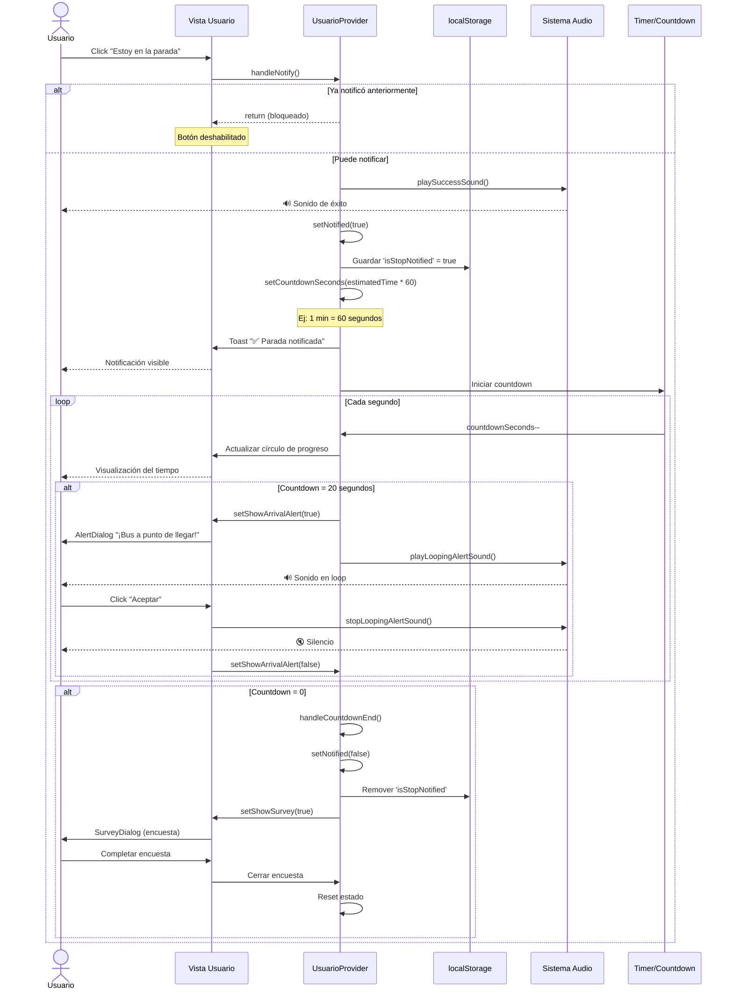
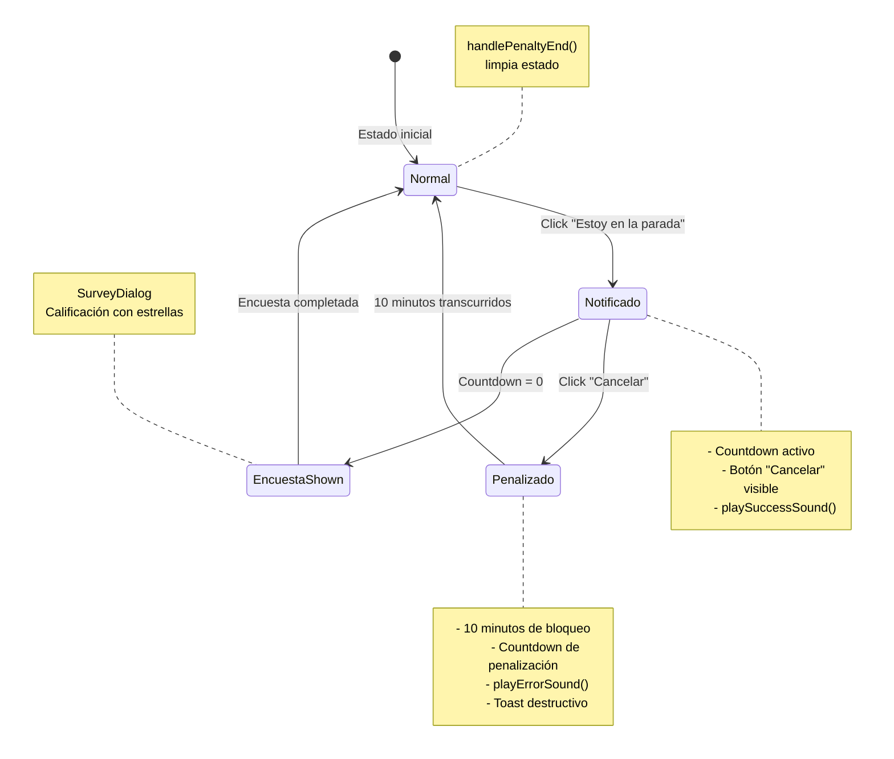
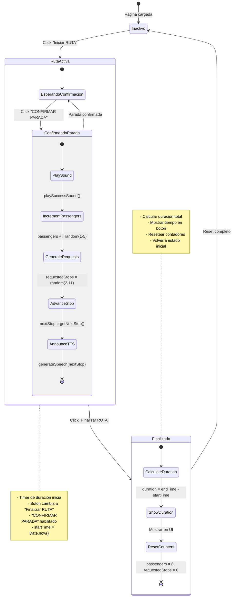
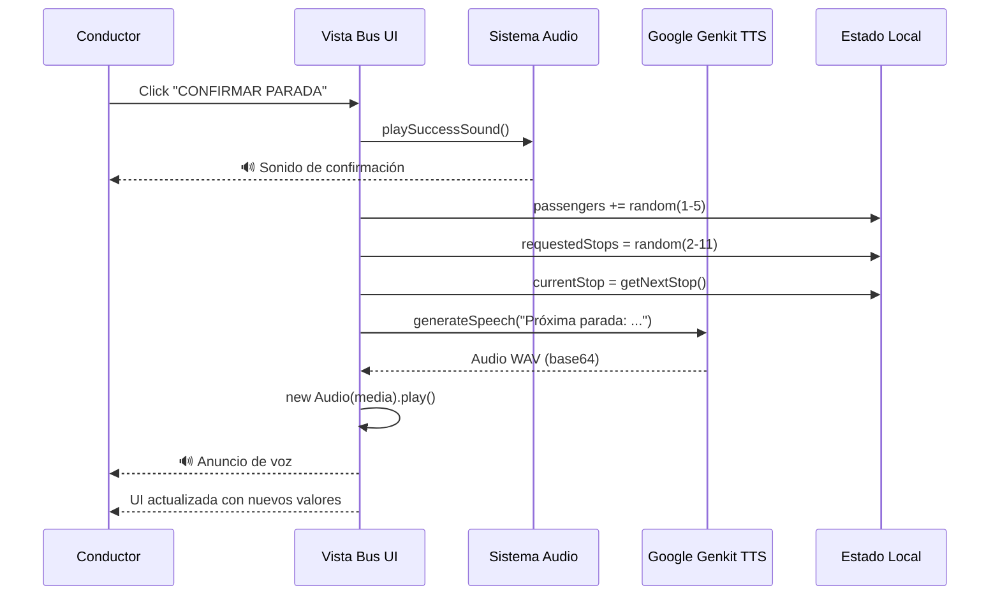
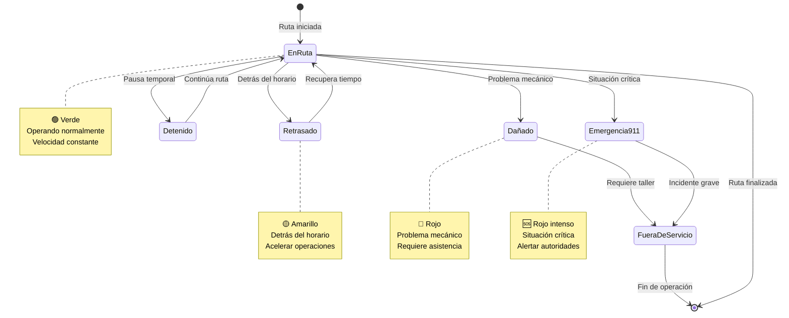
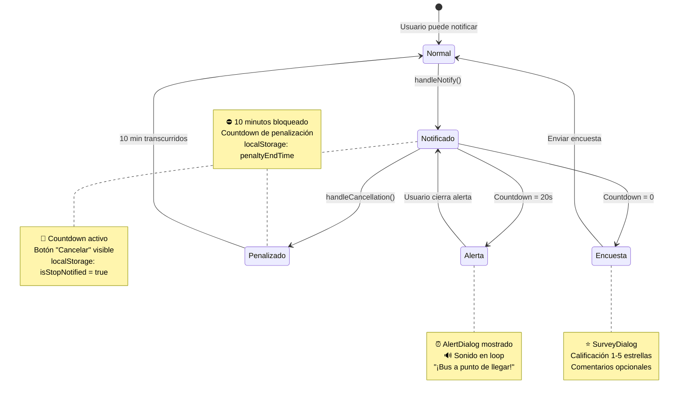
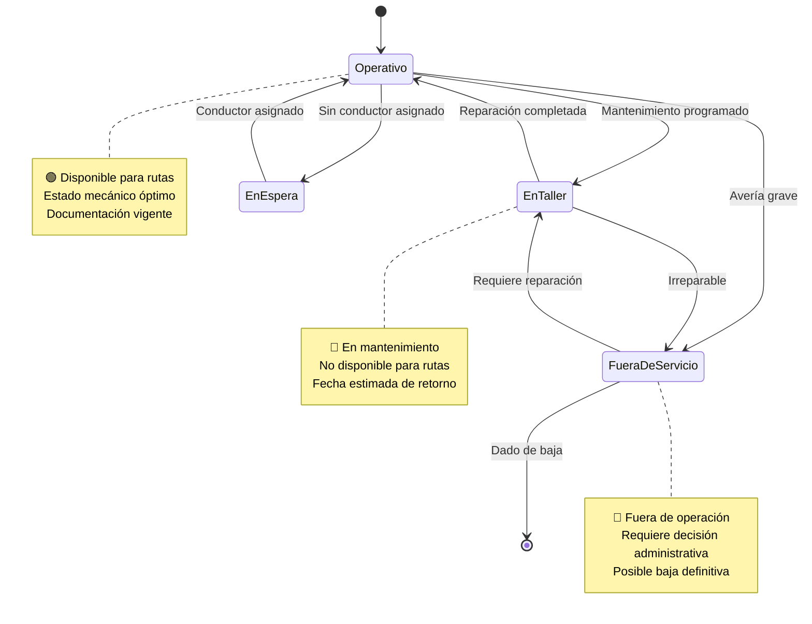

# Flujos de Proceso

**Documentación del Sistema de Ubicación Vehicular CESAC**
**Versión 1.0** | **Última actualización:** Febrero 2025

---

## Índice

1. [Flujo de Notificación de Parada](#flujo-de-notificación-de-parada)
2. [Flujo de Penalización](#flujo-de-penalización)
3. [Flujo de Text-to-Speech (TTS)](#flujo-de-text-to-speech-tts)
4. [Flujo de Tracking y Cambio de Parada](#flujo-de-tracking-y-cambio-de-parada)
5. [Flujo de Operación del Conductor](#flujo-de-operación-del-conductor)
6. [Flujo de Autenticación](#flujo-de-autenticación)
7. [Estados del Sistema](#estados-del-sistema)

---

## Flujo de Notificación de Parada

### Descripción General

Cuando un usuario está en una parada y desea ser recogido por el bus, puede notificar al sistema. Este flujo incluye:
- Notificación de parada
- Countdown en tiempo real
- Alerta de proximidad (20 segundos antes)
- Encuesta de satisfacción post-viaje

### Archivo Principal

[usuario-provider.tsx](../src/app/usuario/usuario-provider.tsx:72-84)

### Diagrama de Secuencia



### Código Clave

#### Función handleNotify

```typescript
// src/app/usuario/usuario-provider.tsx:72-84
const handleNotify = useCallback(() => {
    if (notified) return;  // Bloquear si ya notificó

    playSuccessSound();  // Sonido de confirmación
    setNotified(true);
    localStorage.setItem('isStopNotified', 'true');

    // Convertir minutos a segundos
    setCountdownSeconds(selectedBus.estimatedTime * 60);

    toast({
        title: "✅ Parada notificada con éxito",
        description: `El bus ${selectedBus.id} llegará en aproximadamente ${selectedBus.estimatedTime} minutos.`,
    });
}, [selectedBus, toast, notified]);
```

#### Timer del Countdown

```typescript
// src/app/usuario/usuario-provider.tsx:110-138
useEffect(() => {
    if (!notified || countdownSeconds <= 0) return;

    const timer = setInterval(() => {
        setCountdownSeconds((prev) => {
            const newSeconds = prev - 1;

            // Alerta de proximidad a 20 segundos
            if (newSeconds === 20 && !showArrivalAlert) {
                setShowArrivalAlert(true);
                playLoopingAlertSound();
            }

            // Countdown terminó
            if (newSeconds <= 0) {
                handleCountdownEnd();
                return 0;
            }

            return newSeconds;
        });
    }, 1000);

    return () => clearInterval(timer);
}, [notified, countdownSeconds, showArrivalAlert, handleCountdownEnd]);
```

#### Componente Countdown (Círculo de Progreso)

```typescript
// src/components/countdown.tsx
export function Countdown({ seconds, onComplete }: CountdownProps) {
  const minutes = Math.floor(seconds / 60);
  const remainingSeconds = seconds % 60;
  const percentage = (seconds / initialSeconds) * 100;

  useEffect(() => {
    if (seconds === 0 && onComplete) {
      onComplete();
    }
  }, [seconds, onComplete]);

  return (
    <div className="relative h-40 w-40">
      <svg className="h-40 w-40 transform -rotate-90">
        <circle
          cx="80"
          cy="80"
          r="70"
          stroke="currentColor"
          strokeWidth="8"
          fill="none"
          className="text-muted"
        />
        <circle
          cx="80"
          cy="80"
          r="70"
          stroke="currentColor"
          strokeWidth="8"
          fill="none"
          strokeDasharray={`${2 * Math.PI * 70}`}
          strokeDashoffset={`${2 * Math.PI * 70 * (1 - percentage / 100)}`}
          className="text-primary transition-all duration-1000"
        />
      </svg>
      <div className="absolute inset-0 flex items-center justify-center">
        <span className="text-4xl font-bold">
          {minutes}:{remainingSeconds.toString().padStart(2, '0')}
        </span>
      </div>
    </div>
  );
}
```

### Estados Posibles

| Estado | Descripción | UI Visible | Audio |
|--------|-------------|------------|-------|
| **Normal** | Usuario puede notificar | Botón "Estoy en la parada" | - |
| **Notificado** | Countdown activo | Círculo de progreso + botón "Cancelar" | Sonido de éxito al iniciar |
| **Proximidad** | Quedan 20 segundos | AlertDialog + countdown | Sonido en loop |
| **Completado** | Countdown llegó a 0 | SurveyDialog | - |
| **Penalizado** | Canceló la notificación | Botón deshabilitado con tiempo restante | Sonido de error |

### Persistencia

**localStorage keys:**
- `isStopNotified` - Boolean que indica si el usuario tiene una notificación activa
- Limpiado cuando:
  - Countdown llega a 0
  - Usuario cancela (pero entra en penalización)
  - Usuario cierra la app (se pierde el countdown)

---

## Flujo de Penalización

### Descripción General

Si un usuario notifica una parada y luego cancela, se aplica una **penalización de 10 minutos** durante la cual no puede volver a notificar. Esto evita el abuso del sistema.

### Constante del Sistema

```typescript
// src/lib/data.ts
export const PENALTY_DURATION_MINUTES = 10;
```

### Diagrama de Estados



### Código de Cancelación

```typescript
// src/app/usuario/usuario-provider.tsx:98-109
const handleCancellation = () => {
    // Detener countdown activo
    setNotified(false);
    localStorage.removeItem('isStopNotified');

    // Calcular tiempo de fin de penalización
    const endTime = Date.now() + PENALTY_DURATION_MINUTES * 60 * 1000;
    setPenaltyEndTime(endTime);
    setIsPenaltyActive(true);

    // Guardar en localStorage
    localStorage.setItem('penaltyEndTime', endTime.toString());

    // Sonido de error
    playErrorSound();

    // Notificación destructiva
    toast({
        title: "⚠️ Parada Cancelada",
        description: `Podrás notificar una parada nuevamente en ${PENALTY_DURATION_MINUTES} minutos.`,
        variant: "destructive"
    });
};
```

### Timer de Penalización

```typescript
// src/app/usuario/usuario-provider.tsx:140-158
useEffect(() => {
    if (!isPenaltyActive || !penaltyEndTime) return;

    const checkPenalty = setInterval(() => {
        const remaining = getRemainingPenaltyTime();

        if (remaining <= 0) {
            handlePenaltyEnd();
        }
    }, 1000);

    return () => clearInterval(checkPenalty);
}, [isPenaltyActive, penaltyEndTime, getRemainingPenaltyTime, handlePenaltyEnd]);

const getRemainingPenaltyTime = useCallback(() => {
    if (!penaltyEndTime) return 0;
    const remaining = Math.max(0, Math.ceil((penaltyEndTime - Date.now()) / 1000));
    return remaining;
}, [penaltyEndTime]);
```

### Finalización de Penalización

```typescript
// src/app/usuario/usuario-provider.tsx:160-165
const handlePenaltyEnd = useCallback(() => {
    setIsPenaltyActive(false);
    setPenaltyEndTime(null);
    localStorage.removeItem('penaltyEndTime');

    toast({
        title: "✅ Penalización finalizada",
        description: "Ya puedes notificar una parada nuevamente.",
    });
}, [toast]);
```

### UI del Botón Penalizado

```tsx
{isPenaltyActive ? (
  <Button disabled className="w-full">
    <Clock className="mr-2 h-4 w-4" />
    Penalizado ({Math.floor(getRemainingPenaltyTime() / 60)}:
    {(getRemainingPenaltyTime() % 60).toString().padStart(2, '0')} restantes)
  </Button>
) : (
  <Button onClick={handleNotify} disabled={notified}>
    🔔 Estoy en la parada
  </Button>
)}
```

### Persistencia

**localStorage keys:**
- `penaltyEndTime` - Timestamp en milisegundos del fin de la penalización
- Restaurado al recargar la página si aún está activo

---

## Flujo de Text-to-Speech (TTS)

### Descripción General

El sistema utiliza **Google Genkit 1.13.0** con el modelo **Gemini 2.5 Flash TTS** para generar anuncios de voz en español. Se usa principalmente en la **Vista del Conductor** para anunciar paradas.

### Arquitectura TTS

```
Vista del Conductor → API Route → Server Action → Genkit Flow → Gemini 2.5 Flash TTS → Audio WAV
```

### Archivo Principal

[ai/flows/tts-flow.ts](../ai/flows/tts-flow.ts:1-76)

### Diagrama de Secuencia Completo

```mermaid
sequenceDiagram
    participant VB as Vista Bus<br/>(Cliente)
    participant API as /api/tts<br/>(API Route)
    participant SA as Server Action<br/>generateSpeech()
    participant Flow as generateSpeechFlow<br/>(Genkit)
    participant Genkit as Google Genkit<br/>AI Framework
    participant Gemini as Gemini 2.5 Flash<br/>TTS Model

    VB->>VB: Usuario confirma parada
    VB->>API: POST /api/tts<br/>{text: "Próxima parada: Cruce Sabana Larga"}

    API->>SA: generateSpeech(text)
    SA->>Flow: generateSpeechFlow(text)

    Flow->>Genkit: ai.generate()
    Note over Flow,Genkit: Configuración:<br/>- Model: gemini-2.5-flash-preview-tts<br/>- Voice: Achernar (femenina)<br/>- Modality: AUDIO<br/>- Language: Español

    Genkit->>Gemini: Solicitud TTS
    Note over Gemini: Genera audio<br/>en formato PCM

    Gemini-->>Genkit: Audio PCM (base64)
    Genkit-->>Flow: {media: {url: "data:audio/pcm;base64,..."}}

    Flow->>Flow: toWav(audioBuffer)
    Note over Flow: Conversión PCM → WAV<br/>- Sample Rate: 24kHz<br/>- Bit Depth: 16-bit<br/>- Channels: Mono

    Flow-->>SA: {media: "data:audio/wav;base64,..."}
    SA-->>API: Audio WAV (base64)
    API-->>VB: Response con audio

    VB->>VB: new Audio(media).play()
    Note over VB: Reproducción en<br/>navegador del usuario
```

### Implementación del Flow

#### Definición del Flow

```typescript
// ai/flows/tts-flow.ts:41-71
const generateSpeechFlow = ai.defineFlow(
  {
    name: 'generateSpeechFlow',
    inputSchema: z.string(),  // Texto de entrada
    outputSchema: z.any(),     // Audio en base64
  },
  async (query) => {
    // Generar audio con Gemini
    const { media } = await ai.generate({
      model: googleAI.model('gemini-2.5-flash-preview-tts'),
      config: {
        responseModalities: ['AUDIO'],  // Solo audio, no texto
        speechConfig: {
          voiceConfig: {
            prebuiltVoiceConfig: { voiceName: 'Achernar' }, // Voz femenina en español
          },
        },
      },
      prompt: query,
    });

    if (!media) {
      throw new Error('no media returned');
    }

    // Extraer buffer PCM del data URL
    const audioBuffer = Buffer.from(
      media.url.substring(media.url.indexOf(',') + 1),
      'base64'
    );

    // Convertir PCM a WAV
    return {
      media: 'data:audio/wav;base64,' + (await toWav(audioBuffer)),
    };
  }
);
```

#### Conversión PCM a WAV

```typescript
// ai/flows/tts-flow.ts:14-39
import wav from 'wav';

async function toWav(
  pcmData: Buffer,
  channels = 1,      // Mono
  rate = 24000,      // 24kHz
  sampleWidth = 2    // 16-bit
): Promise<string> {
  return new Promise((resolve, reject) => {
    const writer = new wav.Writer({
      channels,
      sampleRate: rate,
      bitDepth: sampleWidth * 8,  // 16-bit
    });

    let bufs = [] as any[];

    writer.on('error', reject);
    writer.on('data', function (d) {
      bufs.push(d);  // Acumular chunks
    });
    writer.on('end', function () {
      // Concatenar y convertir a base64
      resolve(Buffer.concat(bufs).toString('base64'));
    });

    writer.write(pcmData);
    writer.end();
  });
}
```

#### Server Action Exportada

```typescript
// ai/flows/tts-flow.ts:73-75
'use server';

export async function generateSpeech(text: string) {
  return generateSpeechFlow(text);
}
```

### Uso desde la Vista del Conductor

```typescript
// Ejemplo de uso en vista-bus
import { generateSpeech } from '@/ai/flows/tts-flow';

const handleConfirmStop = async () => {
  playSuccessSound();

  // Avanzar a siguiente parada
  const nextStop = getNextStop();
  setCurrentStop(nextStop);

  // Generar y reproducir anuncio TTS
  try {
    const audio = await generateSpeech(
      `Próxima parada: ${nextStop.nombre}. Prepárense para descender.`
    );

    // Reproducir audio
    const audioElement = new Audio(audio.media);
    audioElement.play();
  } catch (error) {
    console.error('Error generando TTS:', error);
  }

  // Incrementar contadores
  setPassengers(prev => prev + Math.floor(Math.random() * 5) + 1);
  setRequestedStops(Math.floor(Math.random() * 10) + 2);
};
```

### Configuración de Genkit

```typescript
// ai/genkit.ts
import { genkit } from 'genkit';
import { googleAI } from '@genkit-ai/googleai';

export const ai = genkit({
  plugins: [
    googleAI({
      apiKey: process.env.GOOGLE_API_KEY,
    }),
  ],
});
```

### Voces Disponibles

| Nombre | Género | Idioma | Uso en CESAC |
|--------|--------|--------|--------------|
| **Achernar** | Femenina | Español | ✅ Activa |
| Altair | Masculina | Español | - |
| Antares | Masculina | Español | - |

### Desarrollo y Testing

**Scripts disponibles:**

```bash
# Desarrollo con UI de Genkit
npm run genkit:dev
# Abre: http://localhost:4000

# Hot-reload automático
npm run genkit:watch
```

**Genkit Developer UI:** Permite probar flows interactivamente sin necesidad de correr el servidor Next.js.

### Especificaciones Técnicas del Audio

| Parámetro | Valor |
|-----------|-------|
| Formato de salida | WAV |
| Formato de entrada (Gemini) | PCM |
| Sample Rate | 24000 Hz (24kHz) |
| Bit Depth | 16-bit |
| Channels | 1 (Mono) |
| Encoding | Linear PCM |
| Contenedor | RIFF WAV |

---

## Flujo de Tracking y Cambio de Parada

### Descripción General

El sistema **PGA (Proximity Geo Analysis)** permite a los usuarios encontrar la parada más cercana a su ubicación actual y cambiar automáticamente a ella si es diferente de la asignada.

### Archivo Principal

[usuario/horarios/page.tsx](../src/app/usuario/horarios/page.tsx)

### Diagrama de Flujo

```mermaid
flowchart TD
    A[Usuario en /usuario/horarios] --> B[Click "Tracking: Encontrar parada más cercana"]
    B --> C[setIsAnalyzing true]
    C --> D[Mostrar Spinner<br/>"PGA Analysis..."]
    D --> E[setTimeout 4 segundos]

    E --> F[Simular análisis de proximidad]
    F --> G{¿Encontró parada diferente?}

    G -->|No| H[setAnalysisResult null]
    H --> I[Cerrar análisis<br/>Mantener parada actual]

    G -->|Sí| J[setAnalysisResult<br/>found: true<br/>suggestedStop: "Nueva Parada"<br/>distance: "250m"<br/>suggestedBus: "BUSCESAC-2"]

    J --> K[Mostrar AlertDialog<br/>"Parada Encontrada"]
    K --> L{Usuario elige}

    L -->|"No, gracias"| M[Cerrar AlertDialog<br/>No hacer cambios]
    M --> I

    L -->|"Sí, cambiar"| N{¿Ya notificó<br/>parada actual?}

    N -->|Sí, notificado| O[Error AlertDialog<br/>"No puedo ejecutar el cambio"]
    O --> P[Toast destructivo<br/>"Debes cancelar primero"]
    P --> I

    N -->|No, libre| Q[router.push<br/>'/usuario?startTracking=true&busId=X']

    Q --> R[/usuario carga con params]
    R --> S[UsuarioProvider detecta params]
    S --> T[setSelectedBusId busIdParam]
    T --> U[setTimeout handleNotify, 0]
    U --> V[Notificación automática]
    V --> W[Countdown activado]
    W --> Z[Usuario espera el bus]

    style B fill:#3b82f6,color:#fff
    style J fill:#10b981,color:#fff
    style O fill:#ef4444,color:#fff
    style V fill:#f59e0b,color:#fff
```

### Código del Componente de Tracking

```typescript
// src/app/usuario/horarios/page.tsx
"use client";

import { useState } from 'react';
import { useRouter } from 'next/navigation';
import { Button } from '@/components/ui/button';
import { AlertDialog, AlertDialogContent, AlertDialogHeader, AlertDialogTitle, AlertDialogDescription, AlertDialogFooter, AlertDialogCancel, AlertDialogAction } from '@/components/ui/alert-dialog';
import { MapPin, Loader2 } from 'lucide-react';
import { useToast } from '@/hooks/use-toast';

interface AnalysisResult {
  found: boolean;
  suggestedStop: string;
  distance: string;
  suggestedBus: string;
}

export default function HorariosPage() {
  const [isAnalyzing, setIsAnalyzing] = useState(false);
  const [analysisResult, setAnalysisResult] = useState<AnalysisResult | null>(null);
  const router = useRouter();
  const { toast } = useToast();

  const handleTracking = () => {
    setIsAnalyzing(true);

    // Simular análisis PGA por 4 segundos
    setTimeout(() => {
      setIsAnalyzing(false);

      // Resultado simulado (en producción: llamada a API de geolocalización)
      const foundDifferentStop = Math.random() > 0.5;

      if (foundDifferentStop) {
        setAnalysisResult({
          found: true,
          suggestedStop: "Cruce Sabana Larga Norte",
          distance: "250m",
          suggestedBus: "BUSCESAC-2"
        });
      } else {
        toast({
          title: "✅ Análisis completado",
          description: "Tu parada actual es la más cercana.",
        });
      }
    }, 4000);
  };

  const handleChangeStop = () => {
    // Verificar si ya notificó (requiere acceso al Context)
    const isNotified = localStorage.getItem('isStopNotified') === 'true';

    if (isNotified) {
      toast({
        title: "⚠️ No puedo ejecutar el cambio",
        description: "Ya notificaste una parada. Debes cancelarla primero.",
        variant: "destructive"
      });
      setAnalysisResult(null);
      return;
    }

    // Redirigir con parámetros para auto-notificar
    router.push(`/usuario?startTracking=true&busId=${analysisResult?.suggestedBus}`);
  };

  return (
    <div className="space-y-6 p-6">
      {/* Botón de Tracking */}
      <Button
        onClick={handleTracking}
        disabled={isAnalyzing}
        className="w-full"
      >
        {isAnalyzing ? (
          <>
            <Loader2 className="mr-2 h-4 w-4 animate-spin" />
            PGA Analysis...
          </>
        ) : (
          <>
            <MapPin className="mr-2 h-4 w-4" />
            Tracking: Encontrar parada más cercana
          </>
        )}
      </Button>

      {/* AlertDialog de resultado */}
      {analysisResult && (
        <AlertDialog open={!!analysisResult} onOpenChange={() => setAnalysisResult(null)}>
          <AlertDialogContent>
            <AlertDialogHeader>
              <AlertDialogTitle>🎯 Parada Encontrada</AlertDialogTitle>
              <AlertDialogDescription className="space-y-2">
                <p>Encontramos una parada más cercana:</p>
                <p className="font-semibold">{analysisResult.suggestedStop}</p>
                <p className="text-sm text-muted-foreground">
                  Distancia: {analysisResult.distance}
                </p>
                <p className="text-sm text-muted-foreground">
                  Bus sugerido: {analysisResult.suggestedBus}
                </p>
                <p className="mt-4">¿Deseas cambiar a esta parada y notificar automáticamente?</p>
              </AlertDialogDescription>
            </AlertDialogHeader>
            <AlertDialogFooter>
              <AlertDialogCancel>No, gracias</AlertDialogCancel>
              <AlertDialogAction onClick={handleChangeStop}>
                Sí, cambiar
              </AlertDialogAction>
            </AlertDialogFooter>
          </AlertDialogContent>
        </AlertDialog>
      )}

      {/* Accordion de horarios (resto del componente) */}
      {/* ... */}
    </div>
  );
}
```

### Detección de Parámetros en UsuarioProvider

```typescript
// src/app/usuario/usuario-provider.tsx:86-96
useEffect(() => {
    const startTracking = searchParams.get('startTracking');
    const busIdParam = searchParams.get('busId');

    if (startTracking === 'true' && busIdParam) {
        // Verificar que el bus existe
        const busExists = buses.some(bus => bus.id === busIdParam);

        if (busExists) {
            setSelectedBusId(busIdParam);

            // Auto-notificar después de renderizar
            setTimeout(() => handleNotify(), 0);
        }
    }
}, [searchParams, handleNotify, buses]);
```

### Escenarios de Uso

| Escenario | Acción del Sistema |
|-----------|-------------------|
| **Parada más cercana es la actual** | Toast de confirmación, no hace cambios |
| **Encuentra parada diferente + Usuario NO notificó** | AlertDialog → Cambiar → Auto-notificar |
| **Encuentra parada diferente + Usuario YA notificó** | AlertDialog → Error → Toast destructivo |
| **Error de geolocalización** | Toast de error, mantener estado actual |

---

## Flujo de Operación del Conductor

### Descripción General

La **Vista del Conductor** (`/vista-bus`) permite a los choferes:
- Iniciar y finalizar rutas
- Confirmar paradas
- Anunciar paradas con TTS
- Cambiar estado del bus
- Ver información en tiempo real

### Archivo Principal

[vista-bus/page.tsx](../src/app/vista-bus/page.tsx)

### Diagrama de Estados



### Código del Componente

```typescript
"use client";

import { useState, useEffect } from 'react';
import { Button } from '@/components/ui/button';
import { Card, CardContent, CardHeader, CardTitle } from '@/components/ui/card';
import { Badge } from '@/components/ui/badge';
import { Play, Square, Bell, Users, MapPin } from 'lucide-react';
import { WeatherWidget } from '@/components/weather-widget';
import { playSuccessSound } from '@/lib/audio';
import { generateSpeech } from '@/ai/flows/tts-flow';

export default function VistaBusPage() {
  // Estado de ruta
  const [isRouteActive, setIsRouteActive] = useState(false);
  const [routeStartTime, setRouteStartTime] = useState<number | null>(null);
  const [routeDuration, setRouteDuration] = useState(0);

  // Estado de paradas
  const [currentStop, setCurrentStop] = useState("Cruce Sabana Larga");
  const [passengers, setPassengers] = useState(0);
  const [requestedStops, setRequestedStops] = useState(0);

  // Estado del bus
  const [busStatus, setBusStatus] = useState<'En Ruta' | 'Retrasado' | 'Dañado' | '911'>('En Ruta');

  // Reloj digital
  const [currentTime, setCurrentTime] = useState(new Date());

  // Actualizar reloj cada segundo
  useEffect(() => {
    const timer = setInterval(() => {
      setCurrentTime(new Date());
    }, 1000);
    return () => clearInterval(timer);
  }, []);

  // Timer de duración de ruta
  useEffect(() => {
    if (!isRouteActive || !routeStartTime) return;

    const timer = setInterval(() => {
      const elapsed = Date.now() - routeStartTime;
      setRouteDuration(elapsed);
    }, 1000);

    return () => clearInterval(timer);
  }, [isRouteActive, routeStartTime]);

  const handleStartRoute = () => {
    setIsRouteActive(true);
    setRouteStartTime(Date.now());
    setPassengers(0);
    setRequestedStops(Math.floor(Math.random() * 10) + 2);
  };

  const handleEndRoute = () => {
    setIsRouteActive(false);
    setRouteStartTime(null);
    setRouteDuration(0);
    setPassengers(0);
    setRequestedStops(0);
  };

  const handleConfirmStop = async () => {
    playSuccessSound();

    // Incrementar pasajeros
    const newPassengers = Math.floor(Math.random() * 5) + 1;
    setPassengers(prev => prev + newPassengers);

    // Generar nuevas paradas solicitadas
    setRequestedStops(Math.floor(Math.random() * 10) + 2);

    // Avanzar a siguiente parada
    const nextStop = getNextStop();
    setCurrentStop(nextStop);

    // TTS anuncio
    try {
      const audio = await generateSpeech(
        `Próxima parada: ${nextStop}. Prepárense para descender.`
      );
      new Audio(audio.media).play();
    } catch (error) {
      console.error('Error TTS:', error);
    }
  };

  const getNextStop = () => {
    const stops = [
      "Cruce Sabana Larga",
      "Parada Central",
      "Zona Colonial",
      "Terminal Norte"
    ];
    return stops[Math.floor(Math.random() * stops.length)];
  };

  const formatDuration = (ms: number) => {
    const seconds = Math.floor(ms / 1000);
    const minutes = Math.floor(seconds / 60);
    const hours = Math.floor(minutes / 60);
    return `${hours}:${(minutes % 60).toString().padStart(2, '0')}:${(seconds % 60).toString().padStart(2, '0')}`;
  };

  return (
    <div className="min-h-screen bg-background p-6 space-y-6">
      {/* Reloj Digital */}
      <Card>
        <CardContent className="pt-6 text-center">
          <div className="text-6xl font-bold font-mono">
            {currentTime.toLocaleTimeString('es-DO', {
              hour: '2-digit',
              minute: '2-digit',
              second: '2-digit'
            })}
          </div>
          <Badge variant="outline" className="mt-2">
            🟢 Online
          </Badge>
        </CardContent>
      </Card>

      {/* Info del Conductor */}
      <Card>
        <CardHeader>
          <CardTitle className="flex items-center justify-between">
            <span>👨‍✈️ Manuel Gonzalez</span>
            <Button variant="outline" size="icon">
              <Bell className="h-4 w-4" />
            </Button>
          </CardTitle>
        </CardHeader>
        <CardContent>
          <p className="text-muted-foreground">Ficha 01 - Placa: ABC-123</p>
        </CardContent>
      </Card>

      {/* Control de Ruta */}
      <Card>
        <CardContent className="pt-6">
          {!isRouteActive ? (
            <Button onClick={handleStartRoute} className="w-full" size="lg">
              <Play className="mr-2 h-5 w-5" />
              Iniciar RUTA
            </Button>
          ) : (
            <Button onClick={handleEndRoute} className="w-full" size="lg" variant="destructive">
              <Square className="mr-2 h-5 w-5" />
              Finalizar RUTA ({formatDuration(routeDuration)})
            </Button>
          )}
        </CardContent>
      </Card>

      {/* Próxima Parada */}
      {isRouteActive && (
        <Card>
          <CardHeader>
            <CardTitle className="flex items-center">
              <MapPin className="mr-2 h-5 w-5" />
              Próxima Parada
            </CardTitle>
          </CardHeader>
          <CardContent className="space-y-4">
            <p className="text-xl font-semibold">{currentStop}</p>

            <Button onClick={handleConfirmStop} className="w-full" size="lg">
              ✅ CONFIRMAR PARADA
            </Button>

            <div className="grid grid-cols-2 gap-4 mt-4">
              <div className="text-center">
                <Users className="h-6 w-6 mx-auto mb-2" />
                <p className="text-2xl font-bold">{passengers}</p>
                <p className="text-sm text-muted-foreground">Pasajeros</p>
              </div>
              <div className="text-center">
                <MapPin className="h-6 w-6 mx-auto mb-2" />
                <p className="text-2xl font-bold">{requestedStops}</p>
                <p className="text-sm text-muted-foreground">Solicitadas</p>
              </div>
            </div>
          </CardContent>
        </Card>
      )}

      {/* Estado del Bus */}
      <Card>
        <CardHeader>
          <CardTitle>Estado del Bus</CardTitle>
        </CardHeader>
        <CardContent>
          <div className="grid grid-cols-2 gap-2">
            <Button
              variant={busStatus === 'En Ruta' ? 'default' : 'outline'}
              onClick={() => setBusStatus('En Ruta')}
            >
              🟢 En Ruta
            </Button>
            <Button
              variant={busStatus === 'Retrasado' ? 'default' : 'outline'}
              onClick={() => setBusStatus('Retrasado')}
            >
              🟡 Retrasado
            </Button>
            <Button
              variant={busStatus === 'Dañado' ? 'destructive' : 'outline'}
              onClick={() => setBusStatus('Dañado')}
            >
              🔴 Dañado
            </Button>
            <Button
              variant={busStatus === '911' ? 'destructive' : 'outline'}
              onClick={() => setBusStatus('911')}
            >
              🆘 911
            </Button>
          </div>
        </CardContent>
      </Card>

      {/* Weather Widget */}
      <WeatherWidget />
    </div>
  );
}
```

### Secuencia de Confirmación de Parada



---

## Flujo de Autenticación

### Descripción General

El sistema tiene dos modos de acceso:
1. **Login con credenciales** (acceso al Dashboard)
2. **Continuar como invitado** (acceso a Vista de Usuario)

### Diagrama Simple

```mermaid
flowchart LR
    A[/ - Página de Login] --> B{¿Credenciales válidas?}

    B -->|Sí - Admin| C[/dashboard<br/>Panel Administrativo]
    B -->|No| D[❌ Error message<br/>Credenciales incorrectas]
    D --> A

    A --> E[Botón: Continuar como Invitado]
    E --> F[/usuario<br/>Vista Móvil]

    C -.Logout.-> A
    F -.Cerrar sesión.-> A

    style A fill:#3b82f6,color:#fff
    style C fill:#10b981,color:#fff
    style F fill:#f59e0b,color:#fff
    style D fill:#ef4444,color:#fff
```

### Roles del Sistema

| Role | Acceso | Páginas Disponibles |
|------|--------|---------------------|
| **admin** | Dashboard completo | Todas las 15 páginas del dashboard + Data Master |
| **invitado** | Vista de usuario | Solo /usuario y sus 4 subpáginas |

---

## Estados del Sistema

### Estados del Bus



### Estados de Solicitud de Parada

| Estado | Badge | Descripción | Acción Conductor |
|--------|-------|-------------|------------------|
| **Confirmado** | 🟢 Verde | Usuario fue recogido | Parada exitosa |
| **No recogido** | 🔴 Rojo | Bus pasó sin recoger | Reportar incidente |
| **Cancelado** | ⛔ Gris | Usuario canceló | Ignorar solicitud |

### Estados de Usuario (Notificación)



### Estados de Vehículo



---

## Resumen de Constantes del Sistema

| Constante | Valor | Ubicación | Uso |
|-----------|-------|-----------|-----|
| **PENALTY_DURATION_MINUTES** | 10 minutos | [data.ts](../src/lib/data.ts) | Duración de penalización por cancelación |
| **ALERT_THRESHOLD_SECONDS** | 20 segundos | usuario-provider.tsx | Mostrar alerta de proximidad |
| **COUNTDOWN_INTERVAL** | 1000ms (1s) | usuario-provider.tsx | Intervalo de actualización de countdown |
| **PGA_ANALYSIS_DURATION** | 4000ms (4s) | usuario/horarios | Duración del análisis de proximidad |
| **TTS_SAMPLE_RATE** | 24000 Hz | tts-flow.ts | Frecuencia de muestreo del audio |
| **TTS_BIT_DEPTH** | 16-bit | tts-flow.ts | Profundidad de bits del audio |

---

## Eventos y Triggers del Sistema

| Evento | Trigger | Resultado |
|--------|---------|-----------|
| **Usuario notifica parada** | Click botón "Estoy en la parada" | Countdown inicia, localStorage actualizado |
| **Countdown = 20s** | Timer cada segundo | AlertDialog + sonido en loop |
| **Countdown = 0** | Timer termina | SurveyDialog mostrado |
| **Usuario cancela** | Click "Cancelar" | Penalización de 10 min activada |
| **Penalización termina** | Timer de 10 min | Usuario puede volver a notificar |
| **Conductor confirma parada** | Click "CONFIRMAR PARADA" | TTS anuncia siguiente parada |
| **Tracking encuentra parada** | PGA Analysis completo | AlertDialog con sugerencia |
| **Usuario acepta cambio** | Click "Sí, cambiar" | Redirección + auto-notificación |

---

## Recursos Relacionados

- **Arquitectura:** Ver [arquitectura.md](./arquitectura.md) para detalles técnicos de implementación
- **Entidades:** Ver [entidades.md](./entidades.md) para interfaces completas de datos
- **Pantallas:** Ver [pantallas-y-navegacion.md](./pantallas-y-navegacion.md) para mapa de navegación
- **Componentes:** Ver [componentes.md](./componentes.md) para componentes UI utilizados

---

**© 2025 CESAC - Dirección de Tecnología y Comunicaciones**
**Desarrollado por:** Kendy Qualey
